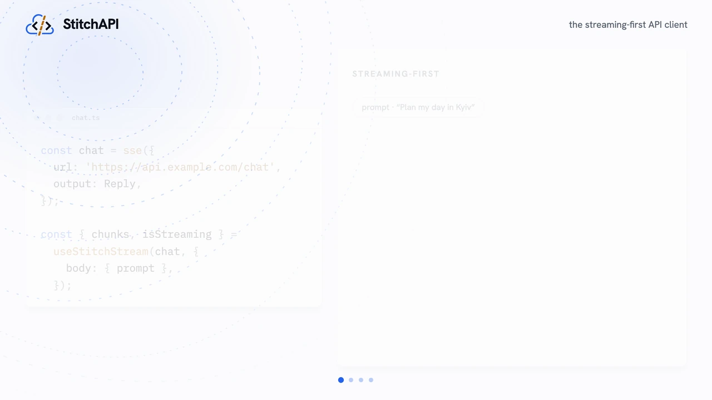

<p align="center">
  <a href="https://stand-with-ukraine.pp.ua"></a>
</p>

<p align="center">
  <picture>
    <source media="(prefers-color-scheme: dark)" srcset="docs/media/baner_dark.png" />
    
  </picture>
</p>

<p align="center">
  <strong>API stitching:</strong> turn any API into a typed, resilient <strong>function</strong>. Declare an endpoint once — its types, auth, and resilience — and call it like a local function. No server, no codegen, no config files. The same definition answers to your code, the CLI, and an AI agent alike.
</p>

<p align="center">
  <a href="https://stitchapi.dev"><strong>📚 stitchapi.dev</strong></a> — documentation, guides &amp; live playground
</p>

<p align="center">
  <a href="https://www.npmjs.com/package/stitchapi?activeTab=dependencies"></a>
  
  <a href="https://scorecard.dev/viewer/?uri=github.com/rejifald/StitchAPI"></a>
  <a href="https://www.npmjs.com/package/stitchapi"></a>
</p>

<!-- yakir:readme-badges -->

<p align="center">
  
  
</p>

<!-- /yakir:readme-badges -->

<p align="center">
  <strong>Zero runtime dependencies · ~24&nbsp;kB min+gzip</strong> — a typical <code>import { stitch }</code> tree-shakes to ~21&nbsp;kB, and with no transitive tree there is nothing else to install or audit. The size is an <a href="packages/core/scripts/bundle-size.mjs">enforced budget in CI</a>, not an aspiration.
</p>

<p align="center">
  <strong>Verifiable supply chain</strong> — every package publishes from GitHub Actions over OIDC with a signed <a href="https://docs.npmjs.com/generating-provenance-statements">npm build-provenance attestation</a>, so you can confirm which commit and which workflow produced the tarball you installed. Each release also ships an <strong>SBOM</strong> in both SPDX and CycloneDX, and the repo is scored publicly by <a href="https://scorecard.dev/viewer/?uri=github.com/rejifald/StitchAPI">OpenSSF Scorecard</a>.
</p>

<p align="center">
  <a href="https://stitchapi.dev/demo">
    <picture>
      <source media="(prefers-color-scheme: dark)" srcset="docs/media/demo-dark.webp 1x, docs/media/demo-dark@2x.webp 2x" />
      
    </picture>
  </a>
</p>

<p align="center">
  <sub><a href="https://stitchapi.dev/demo">Watch more</a></sub>
</p>

> [!NOTE]
>
> **StitchAPI is at `1.0.0-rc.7`.** The core runtime is feature-complete, zero-dependency, covered by a green test gate, and already running in production in two projects. We're validating in the wild before stamping a stable `1.0.0` — pin an exact version and expect only small, documented changes. Feedback is welcome.

---

## Table of Contents

- [What is a stitch?](#what-is-a-stitch)
- [Motivation](#motivation)
- [Why StitchAPI](#why-stitchapi)
- [What StitchAPI is not](#what-stitchapi-is-not)
- [Features](#features)
- [Install](#install)
- [Quick start](#quick-start)
- [Composition: seam, extends, `.with()`](#composition-seam-extends-with)
- [Validation & leveled drift](#validation--leveled-drift)
- [Resilience: retry, throttle, timeout](#resilience-retry-throttle-timeout)
- [Caching](#caching)
- [Auth as a boundary](#auth-as-a-boundary)
- [Surfaces: any request style](#surfaces-any-request-style)
- [Four front doors](#four-front-doors)
- [Agent-native](#agent-native)
- [Errors & pitfalls](#errors--pitfalls)
- [Zero-infra observability](#zero-infra-observability)
- [Packages](#packages)
- [Documentation](#documentation)
- [Contributing](#contributing)
- [License](#license)

## What is a stitch?

A **stitch** is StitchAPI's core primitive: it takes a single endpoint and hands back a callable. You declare the contract once — input, output, auth, resilience — and call it like a local function. The same definition your code calls, the CLI runs and an AI agent invokes — and every caller gets a **capability, not a credential**. A service with more than one endpoint is a **seam** — a group of stitches that share a base URL, auth, and one runtime (throttle budget, store, trace sink).

```ts
import { stitch } from 'stitchapi';
import { z } from 'zod';

const getUser = stitch({
    path: 'https://api.example.com/users/{id}',
    output: z.object({ id: z.number(), name: z.string() }),
    pick: 'data',
});

const user = await getUser({ params: { id: 1 } }); // typed · validated
```

Keep the `fetch` or axios you already have — it's the adapter underneath. A stitch sits _above_ the transport and turns an endpoint into a function rather than replacing the call.

## Motivation

In almost every project there's a `src/api/` folder of thin functions that fire an HTTP request and pull the payload out of the response. Everything that actually makes an integration reliable — auth lifecycle, retries, rate limits, timeouts, response validation, drift detection, observability — gets re-implemented at every call site, and each wrapper rots independently. `fetch` hands back opaque bytes, and raw bytes aren't what application code (or an AI agent) needs; both want structured, validated, observable results.

A stitch folds all of that back into the call:

| Around raw `fetch`, you hand-roll…                  | …a stitch declares it once                                    |
| --------------------------------------------------- | ------------------------------------------------------------- |
| Opaque bytes you parse and hope are the right shape | Schema-validated, typed results — drift caught on every call  |
| A throw on the first failure, then it's on you      | Retries with backoff + jitter, honoring `Retry-After`         |
| One coarse timeout, if you remember it              | Layered total / per-attempt timeouts with real aborts         |
| No rate control — you meet the 429s in production   | Proactive throttle: rate + concurrency caps, shared per host  |
| A raw byte stream you frame and paginate yourself   | SSE framing, delta concatenation, auto-pagination             |
| Zero visibility into what the call did              | A typed event stream + opt-in traces: latency, retries, drift |

## Why StitchAPI

There are plenty of ways to get a typed API client — spec-based generators, hand-authored contract clients, workflow platforms, or a folder of hand-rolled fetch wrappers. StitchAPI sits in a spot none of them cover: it turns **one endpoint at a time** into a resilient, validated, observable function — no spec, no codegen, no config files, no server; only explicit composition.

- **Atomic, not spec-first.** Spec-based generators (openapi-generator, Orval, Kubb, …) need a complete OpenAPI document first — and most real-world APIs (internal, undocumented, the long tail) never get one. A stitch needs a URL and one example response.
- **A runtime, not a code generator.** No generated SDK to commit, diff, and regenerate. The declaration _is_ the client, validated on every live call — so a silently renamed field is a loud, leveled **drift** signal, not an `undefined` three layers downstream.
- **Resilience is declared, not hand-rolled.** Retries, throttling, timeouts, circuit breaking, pagination — configuration on the stitch, uniform across every integration.
- **Auth is a boundary.** A stitch owns its credential and lifecycle; callers get a **capability, not the credential**. That matters double when the caller is an AI agent.
- **Agents are first-class callers.** One definition is a function, a CLI command, an HTTP endpoint, and an MCP tool — returning structured, schema-validated, traceable results instead of opaque bytes.
- **A library, not a platform.** Zero runtime dependencies, embeds in your project, nothing to operate.

| Alternative                                            | Needs                    | You maintain                                          | StitchAPI instead                                                        |
| ------------------------------------------------------ | ------------------------ | ----------------------------------------------------- | ------------------------------------------------------------------------ |
| Spec-based codegen (openapi-generator, Orval, Kubb, …) | a complete OpenAPI spec  | a generated SDK, regenerated on every API change      | one endpoint at a time, validated live at runtime                        |
| Typed runtime clients (Zodios, ts-rest, …)             | a hand-authored contract | your own retry / auth / rate-limit code around it     | resilience, auth lifecycle, and drift detection built into the primitive |
| Workflow platforms (Windmill, n8n, …)                  | a server to deploy       | flows inside someone else's runtime                   | a zero-dependency library; composition is just code                      |
| Hand-rolled `fetch` wrappers                           | nothing                  | bespoke auth, retries, limits — re-solved per project | the same concerns, declared once per stitch                              |

For the full competitive landscape and positioning, see the [Overview](docs/OVERVIEW.md).

## What StitchAPI is not

Knowing what a tool refuses to be is how you trust what it is:

- **Not an HTTP client or `fetch` replacement** — `fetch`/axios are the substrate underneath; a stitch sits above the transport.
- **Not a code generator** — no SDK to commit, diff, and regenerate; the declaration is the runtime, validated live.
- **Not spec-first** — no OpenAPI document required; a URL and one example response is enough.
- **Not a server to deploy** — a zero-dependency library you import, for the APIs you don't control.
- **Not a workflow engine or iPaaS** — no orchestration, queues, or visual builder; composition is plain TypeScript.
- **No config files or hidden inheritance** — nothing ambient a stitch silently reads.

No server, no codegen, no config files, no implicit inheritance — **only explicit composition.**

## Features

- **One primitive, scoped to a surface** — `stitch(url | config)` returns a typed callable; **a service with more than one endpoint is a `seam`** that shares base, auth, throttle budget, store, and trace sink across its members.
- **Event-stream core** — every call yields a typed stream (`start → progress → drift → result → done`); `await` is sugar that returns the final validated value.
- **Bring-your-own validation** — [Zod](https://zod.dev) or any [Standard Schema](https://standardschema.dev) validator (Valibot, ArkType, …); types are inferred from the schemas.
- **Leveled drift detection** — live responses validated against the declared schema (the contract); a required field missing/incompatible **throws**, while soft drift (a coercion, an undeclared or defaulted field) surfaces as a non-fatal `warn` / `info` / `verbose` finding instead of a silent `undefined`.
- **Declared resilience** — retry with backoff and `Retry-After`, proactive throttle, layered timeouts, a circuit breaker, and idempotency keys.
- **Read-through caching** — opt-in response cache + in-process coalescing, keyed by a derived, principal-scoped key, loaded lazily from `stitchapi/cache`.
- **Auth as a boundary** — `bearer`, `apiKey`, `basic`, `cookieSession` (auto-login/re-login), `oauth2`; secrets resolve at call time and never reach the caller.
- **Any request style** — `http` by default; `graphql`, `sse`, `stream`, `download`, `llm`, `shell`, and `postmessage` are peer surfaces behind subpath imports.
- **Pluggable state store** — throttle counters and sessions behind a 3-method store; swap in Redis/Postgres to go distributed.
- **Zero-infra observability** — tracing is **off by default**; opt in per stitch or via `STITCH_TRACE_*` env vars. No collector, no dashboard.
- **Four front doors, one definition** — in-process function, CLI (`stitch run`), HTTP (`stitch serve`), and MCP (`stitch mcp`).
- **Zero runtime dependencies** — `"dependencies": {}`, built on global `fetch`, tree-shakeable; **~24 kB min+gzip** for the whole entry, **~21 kB** for a typical `import { stitch }`.

## Install

```bash
npm install stitchapi@rc   # or: pnpm add stitchapi@rc · yarn add stitchapi@rc
```

Validation is bring-your-own — pass a [Zod](https://zod.dev) schema or any [Standard Schema](https://standardschema.dev) validator; none is bundled. The examples below use Zod for familiarity, and `api.example.com` as an illustrative host — point them at your own API to run them, or try them as-is in the [playground](https://stitchapi.dev/#playground), which serves that host from an in-browser simulator.

## Quick start

The smallest stitch is a URL — declare once, call many times:

```ts
import { stitch } from 'stitchapi';

const getUsers = stitch('https://api.example.com/users');

const users = await getUsers(); // GET, parsed JSON
```

Path params use [RFC 6570](https://datatracker.ietf.org/doc/html/rfc6570) URI templates; `params`, `query`, `headers`, and `body` all travel in one input object:

```ts
const getUser = stitch('https://api.example.com/users/{id}');

await getUser({ params: { id: 1 }, query: { expand: 'roles' } });
// → GET https://api.example.com/users/1?expand=roles
```

Reach for the full set of knobs only when you need them — they default off:

```ts
const getUser = stitch({
    path: 'https://api.example.com/users/{id}',
    output: User, // a validator of your choice
    pick: 'data',
    retry: 3, // ≡ { attempts: 3 }
    timeout: '5s', // ≡ { total: '5s' }
    cache: '1m', // ≡ { ttl: '1m' }
});

const user = await getUser({ params: { id: 42 } });
// → typed · validated · retried · cached
```

A stitch yields a typed **event stream**; `await` consumes it and returns the final value, while `.safe()` resolves to `{ ok, data, error }` and `.stream()` yields progress, throttle waits, retries, and drift as they happen.

## Composition: seam, extends, `.with()`

Everything reusable is a named value, and a stitch composes values — **no global config is ever required**. A service with more than one endpoint is a `seam`: declare the shared base, auth, and budget once; each endpoint is a member that inherits the config _and_ shares one runtime (throttle bucket, store, trace sink):

```ts
import { seam } from 'stitchapi';

const api = seam({
    baseUrl: 'https://api.example.com',
    retry: { attempts: 3, on: [429, 503] },
    timeout: { total: '30s' },
});

const listUsers = api.stitch({
    path: '/users',
    output: User.array(),
    pick: 'data',
});
const getUser = api.stitch({
    path: '/users/{id}',
    output: User,
    pick: 'data',
});
```

For lighter reuse, `extends: [fragment | stitch]` merges config left→right (own fields win), and `.with()` pre-binds part of the input while reusing the same runtime. Full guide: [Authoring](https://stitchapi.dev/docs/guides/authoring/stitch).

## Validation & leveled drift

The declared `output` schema **is** the contract. Wrap it in `drift()`: a response is validated (the call returns the validated value — coerced, defaulted, unknown keys stripped), and the difference between the raw body and that validated value is reported as a leveled, non-fatal signal:

| Change         | What it means                                              | Level     |
| -------------- | ---------------------------------------------------------- | --------- |
| **invalid**    | a required field missing or incompatible — **throws**      | `error`   |
| **coerced**    | a coercion (`"42"`→`42`): a wire-type shift validation hid | `warn`    |
| **undeclared** | a key the schema strips                                    | `info`    |
| **defaulted**  | a `.default()` fired (field absent)                        | `verbose` |

```ts
import { drift, stitch } from 'stitchapi';
import { z } from 'zod';

const listOrders = stitch({
    path: 'https://api.example.com/users/{id}/orders',
    pick: 'data',
    output: drift(
        z.array(z.object({ id: z.number(), total: z.number().optional() })),
        {
            ignore: ['[].meta'], // acknowledged, unconsumed — don't report it
            severity: { coerced: 'info' }, // re-level a kind, or pass a level/list to filter
        },
    ),
});
```

Drift is schema-anchored — no snapshot to manage. Severity lives in the schema: a required field missing/incompatible is a hard `invalid` that **throws**; everything else is non-fatal drift on the event stream. Declared variance (an optional field, a nullable, an empty array) validates clean, so it's never a false alarm; `ignore` silences known-but-unconsumed fields and `severity` filters or re-levels the soft signals. The request side validates too: `input` takes a schema per part and fails fast before any request is sent. Full guide: [Validation & drift](https://stitchapi.dev/docs/guides/validation/drift).

## Resilience: retry, throttle, timeout

The things every `src/api/` folder reinvents are configuration here — uniform across every stitch:

```ts
const listUsers = stitch({
    baseUrl: 'https://api.example.com',
    path: '/users',
    retry: { attempts: 4, on: [429, 502, 503] },
    throttle: { rate: '1/s', concurrency: 2, pool: 'host' },
    timeout: { total: '30s', each: '10s' },
});
```

`throttle` is proactive (keeps you under a limit before it bites; `pool: 'host'` shares a limiter across stitches), `retry` is reactive (backoff + `Retry-After`), and `timeout` aborts with a real `AbortSignal`. Three more knobs round it out: **`circuit`** fast-fails a dependency that's already down, **`idempotency`** injects a stable `Idempotency-Key` on writes, and **`verdict`** declares what counts as success — `accept` treats a non-2xx (e.g. `404`) as a normal result instead of a throw, `flag` fails a `200` whose body says it failed. Full guide: [Resilience](https://stitchapi.dev/docs/guides/resilience/retry).

## Caching

A read-through response cache with in-process request coalescing — **off by default**, loaded lazily from `stitchapi/cache` only when a stitch sets `cache`. The key is **derived** from the resolved request (no caller-authored keys to drift) and **principal-scoped by default**, so user A is never served user B's cached response:

```ts
const getUser = stitch({
    path: 'https://api.example.com/users/{id}',
    output: User,
    pick: 'data',
    cache: '5m',
});

const listAnnouncements = stitch({
    path: 'https://api.example.com/announcements',
    output: z.array(z.object({ id: z.number(), title: z.string() })),
    pick: 'data',
    cache: {
        ttl: '1h',
        tenancy: 'app',
        vary: ['accept-language'],
        entries: 500,
        fingerprint: 1, // pins the shape — cacheable without a fingerprinter
    },
});
```

Caching is sound by construction: a stitch with an `output` schema caches only when that schema can be fingerprinted or you pin a `fingerprint` tag — otherwise it **refuses to cache** rather than serve a stale shape. Mark sensitive data `sensitive: true` to opt out entirely.

## Auth as a boundary

Auth is a field on the stitch — never global. Secrets resolve **at call time** (`env()`, `secretsFile()`), the declaration is committable, and the caller gets data without ever seeing the credential:

```ts
import { stitch } from 'stitchapi';
import { bearer, env } from 'stitchapi/auth';

const getUser = stitch({
    path: 'https://api.example.com/users/{id}',
    auth: bearer(env('API_TOKEN')), // resolved per call; the caller passes no secret
});
```

`bearer`, `apiKey`, and `basic` are header strategies; `oauth2()` runs the client-credentials grant and caches/refreshes the token; and `cookieSession` runs a login, captures the cookie, replays it, and re-logs-in when the wall returns — the caller never sees the password or writes the cookie dance. Full guide: [Auth](https://stitchapi.dev/docs/guides/auth/bearer).

## Surfaces: any request style

A **surface** is the request _style_ a stitch speaks. `http` is the default; the rest are peer surfaces on the same engine — `auth`, `retry`, `throttle`, `timeout`, validation, and the event stream compose with every one. Each ships as its own subpath import, so `import { stitch }` pulls in `http` alone.

| Surface       | Import                        | Shapes                                    | `await` resolves to            |
| ------------- | ----------------------------- | ----------------------------------------- | ------------------------------ |
| `http`        | `stitch` (default)            | a JSON-over-HTTP call                     | the validated body             |
| `graphql`     | `stitchapi/graphql`           | POST `{ query, variables }`, picks `data` | the `data` payload             |
| `sse`         | `stitchapi/sse`               | a `text/event-stream` reader (over fetch) | every parsed event, collected  |
| `stream`      | `stitchapi/stream`            | a raw `ReadableStream` reader             | every decoded chunk, collected |
| `download`    | `stitchapi/download`          | a buffered binary GET                     | `{ blob, filename }`           |
| `llm`         | `stitchapi/llm`               | a chat-completion via a provider contract | the normalised `{ text, … }`   |
| `shell`       | `@stitchapi/shell` (peer pkg) | a local command, args + stdin             | the command's stdout           |
| `postmessage` | `stitchapi/postmessage`       | a typed iframe ↔ parent RPC / event call  | the typed RPC response         |

Full guide: [Surfaces](https://stitchapi.dev/docs/reference/surfaces).

## Four front doors

The same typed unit is reachable four ways, so humans and agents call exactly the same validated, observable thing:

| Front door              | How             | Example                   |
| ----------------------- | --------------- | ------------------------- |
| **In-process function** | import and call | `await listUsers()`       |
| **CLI command**         | `stitch run`    | `$ stitch run list-users` |
| **HTTP endpoint**       | `stitch serve`  | `GET /list-users`         |
| **MCP / agent tool**    | `stitch mcp`    | `tool: list_users`        |

`stitch run` streams every event as one JSON line on stdout (ready for `jq`); `stitch trace` summarizes the run log — runs, failures, retries, drift, and latency percentiles. Full guide: [Surfaces → CLI](https://stitchapi.dev/docs/surfaces/cli).

## Agent-native

A stitch is built to be invoked by an AI agent. Auth lives on the stitch, so an agent gets a **capability, not a credential**. And rather than one MCP tool per endpoint (which floods the model's context), an agent drives a single **code-mode** tool, `run_stitch`: it writes a small TypeScript snippet that imports `stitchapi` and calls the stitch, with `list_stitches` and `describe_stitch` for discovery — so the context budget stays flat as the catalog grows.

Authoring is agent-friendly too — hand an agent one `curl`/HAR/doc example and it emits a stitch declaration, with a deterministic shortcut for the common case:

```bash
$ stitch from-curl 'curl https://api.example.com/users/7 -H "authorization: Bearer …"'
# prints a ready-to-commit stitch: id-like segments lifted to {params}, secrets → env()
```

`stitch init` writes the “declare a stitch, don't hand-roll `fetch`” rule into the files coding agents read (`AGENTS.md`, Cursor/Windsurf/Cline rules, a `CLAUDE.md` section), and the docs build emits an auto-generated [`llms.txt`](https://stitchapi.dev/llms.txt). Full guide: [Use from an agent](https://stitchapi.dev/docs/agents).

## Errors & pitfalls

A failed stitch throws a `StitchError` — an `Error` subclass carrying `.status`, `.attempts`, and (for response failures) `.body` (the parsed error payload, on a non-enumerable channel that never reaches a trace sink) and `.url`. Prefer branching? `.safe()` resolves to `{ ok, data, error }`. Branch on `.status` and `.attempts` (plus `instanceof RateLimitError`) — the `STITCH_*` names below are **documentation IDs, not runtime values**, so there is no `error.code` to match on:

| Catalog ID            | When                                                              |
| --------------------- | ----------------------------------------------------------------- |
| `STITCH_VALIDATION`   | a response failed its output schema                               |
| `STITCH_DRIFT`        | a response drifted past the level you allowed                     |
| `STITCH_AUTH_WALL`    | auth failed, or a soft `200` login wall couldn't be refreshed     |
| `STITCH_TIMEOUT`      | a call exceeded its timeout budget                                |
| `STITCH_CIRCUIT_OPEN` | the circuit breaker is open after repeated failures               |
| `STITCH_GRAPHQL`      | a GraphQL response came back `200` but carried an `errors` array  |
| `RateLimitError`      | a delegate-backoff stitch surfaced a rate-limit for an outer gate |

Full catalog: [Errors & pitfalls](https://stitchapi.dev/docs/errors).

## Zero-infra observability

Observability is a consumer of the event stream, not a separate system — and it's **off by default**. Opt in per stitch (`trace: 'console'` / `fileSink(path)` / a `TraceSink`) or globally with env vars — no collector, no dashboard, nothing to deploy:

```bash
STITCH_TRACE_CONSOLE=1 node app.js          # live, colored, one line per event on stderr
STITCH_TRACE_FILE=./run.jsonl node app.js   # append JSONL to a path
STITCH_EXPORT=otlp node app.js              # also fan events to an OTLP collector
```

Built-in sinks scrub secrets at the sink boundary (the live request is never touched). `stitch trace` summarizes the JSONL; [`@stitchapi/pino`](https://stitchapi.dev/docs/integrations/pino) ships the same events as structured logs.

## Packages

This repository is a [pnpm](https://pnpm.io) workspace. The published library is [`stitchapi`](packages/core); the rest are thin, peer-dependency integrations that add no capability of their own. The table below is **generated** by `pnpm gen:readme` (and verified in CI by `pnpm check:readme`): it lists every publishable workspace package, so it never drifts as packages are added. Each package's own README links to it on npm.

<!-- yakir:readme-packages -->

<table>
<thead><tr><th>Package</th><th>Description</th></tr></thead>
<tbody>
<tr><th colspan="2">Core</th></tr>
<tr><td><a href="packages/core"><code>stitchapi</code></a></td><td>Turn any API into a typed, resilient function</td></tr>
<tr><th colspan="2">Server frameworks</th></tr>
<tr><td><a href="packages/elysia"><code>@stitchapi/elysia</code></a></td><td>Web-standard seam on the context; SSE and error mapping</td></tr>
<tr><td><a href="packages/express"><code>@stitchapi/express</code></a></td><td>Request-scoped seam on req, with SSE and error mapping</td></tr>
<tr><td><a href="packages/fastify"><code>@stitchapi/fastify</code></a></td><td>App/request seam with SSE, error and Pino-logger bridges</td></tr>
<tr><td><a href="packages/hono"><code>@stitchapi/hono</code></a></td><td>Edge-ready seam on the request context; SSE and errors</td></tr>
<tr><td><a href="packages/nest"><code>@stitchapi/nest</code></a></td><td>Injectable stitches wired into the Nest DI graph</td></tr>
<tr><td><a href="packages/next"><code>@stitchapi/next</code></a></td><td>Stream a stitch as an SSE Response in the App Router</td></tr>
<tr><th colspan="2">Client &amp; UI bindings</th></tr>
<tr><td><a href="packages/angular"><code>@stitchapi/angular</code></a></td><td>Stitch lifecycle as Angular signals and an RxJS observable</td></tr>
<tr><td><a href="packages/expo"><code>@stitchapi/expo</code></a></td><td>Streaming over expo/fetch with a secure-store token store</td></tr>
<tr><td><a href="packages/query-core"><code>@stitchapi/query-core</code></a></td><td>Framework-agnostic reactive store behind the UI bindings</td></tr>
<tr><td><a href="packages/react"><code>@stitchapi/react</code></a></td><td>Tearing-free useStitch / useStitchStream hooks</td></tr>
<tr><td><a href="packages/react-native"><code>@stitchapi/react-native</code></a></td><td>Streaming XHR adapter and AsyncStorage-backed store</td></tr>
<tr><td><a href="packages/solid"><code>@stitchapi/solid</code></a></td><td>createStitch primitives reconciled into a Solid store</td></tr>
<tr><td><a href="packages/svelte"><code>@stitchapi/svelte</code></a></td><td>Stitch stores for Svelte 4 and 5 (unary + streaming)</td></tr>
<tr><td><a href="packages/vue"><code>@stitchapi/vue</code></a></td><td>Reactive useStitch / useStitchStream composables</td></tr>
<tr><th colspan="2">Data-fetching libraries</th></tr>
<tr><td><a href="packages/rtk-query"><code>@stitchapi/rtk-query</code></a></td><td>Run a stitch as an RTK Query endpoint, with stream updates</td></tr>
<tr><td><a href="packages/swr"><code>@stitchapi/swr</code></a></td><td>Run a stitch as an SWR fetcher; SWR owns caching</td></tr>
<tr><th colspan="2">State stores</th></tr>
<tr><td><a href="packages/cloudflare-kv"><code>@stitchapi/cloudflare-kv</code></a></td><td>Edge cache and shared sessions on Workers KV</td></tr>
<tr><td><a href="packages/deno-kv"><code>@stitchapi/deno-kv</code></a></td><td>Distributed throttle and sessions on Deno KV</td></tr>
<tr><td><a href="packages/redis"><code>@stitchapi/redis</code></a></td><td>Distributed throttle and shared sessions via Redis</td></tr>
<tr><th colspan="2">Auth</th></tr>
<tr><td><a href="packages/aws-sigv4"><code>@stitchapi/aws-sigv4</code></a></td><td>Sign requests with AWS SigV4 (edge-safe Web Crypto)</td></tr>
<tr><th colspan="2">AI</th></tr>
<tr><td><a href="packages/vercel-ai"><code>@stitchapi/vercel-ai</code></a></td><td>Expose a stitch as a model-callable tool, credential-safe</td></tr>
<tr><th colspan="2">Observability</th></tr>
<tr><td><a href="packages/pino"><code>@stitchapi/pino</code></a></td><td>The stitch event stream as structured Pino logs</td></tr>
<tr><td><a href="packages/sentry"><code>@stitchapi/sentry</code></a></td><td>Stitch events as Sentry breadcrumbs, with error capture</td></tr>
<tr><th colspan="2">Surfaces</th></tr>
<tr><td><a href="packages/shell"><code>@stitchapi/shell</code></a></td><td>Run a static local command as a stitch (injection-proof)</td></tr>
<tr><th colspan="2">Cache fingerprint adapters</th></tr>
<tr><td><a href="packages/fingerprint-arktype"><code>@stitchapi/fingerprint-arktype</code></a></td><td>Cache-fingerprint strategy for ArkType schemas</td></tr>
<tr><td><a href="packages/fingerprint-effect"><code>@stitchapi/fingerprint-effect</code></a></td><td>Cache-fingerprint strategy for Effect Schema</td></tr>
<tr><td><a href="packages/fingerprint-typebox"><code>@stitchapi/fingerprint-typebox</code></a></td><td>Cache-fingerprint strategy for TypeBox schemas</td></tr>
<tr><td><a href="packages/fingerprint-valibot"><code>@stitchapi/fingerprint-valibot</code></a></td><td>Cache-fingerprint strategy for Valibot schemas</td></tr>
<tr><td><a href="packages/fingerprint-zod"><code>@stitchapi/fingerprint-zod</code></a></td><td>Cache-fingerprint strategy for Zod schemas</td></tr>
<tr><th colspan="2">Other</th></tr>
<tr><td><a href="packages/docs-mcp"><code>@stitchapi/docs-mcp</code></a></td><td>StitchAPI documentation search, running locally over MCP stdio</td></tr>
<tr><td><a href="packages/json-schema"><code>@stitchapi/json-schema</code></a></td><td>Turn a runtime-discovered JSON Schema into a Standard Schema validator StitchAPI accepts</td></tr>
<tr><td><a href="packages/openapi"><code>@stitchapi/openapi</code></a></td><td>Eject selected operations from an OpenAPI document into ready-to-own StitchAPI source</td></tr>
</tbody>
</table>

<!-- /yakir:readme-packages -->

## Documentation

The full documentation site lives at **[stitchapi.dev](https://stitchapi.dev)** — [Quickstart](https://stitchapi.dev/docs/getting-started/quickstart), per-feature [Guides](https://stitchapi.dev/docs/guides/authoring/stitch), [Concepts](https://stitchapi.dev/docs/concepts/the-stitch), [Surfaces](https://stitchapi.dev/docs/surfaces/function), [For agents](https://stitchapi.dev/docs/agents), and the generated [Reference](https://stitchapi.dev/docs/reference/stitch).

The published library's own README (what npm renders) is in [`packages/core/README.md`](packages/core/README.md). Design notes live in [`docs/`](docs): [Feature Lenses](docs/FEATURE-LENSES.md), [Overview](docs/OVERVIEW.md), [Design](docs/DESIGN.md).

## Contributing

Local setup, the dev loop, the bundle-size budget, and the worktree + PR workflow are documented in [`CONTRIBUTING.md`](CONTRIBUTING.md).

## License

[Apache-2.0](LICENSE)
