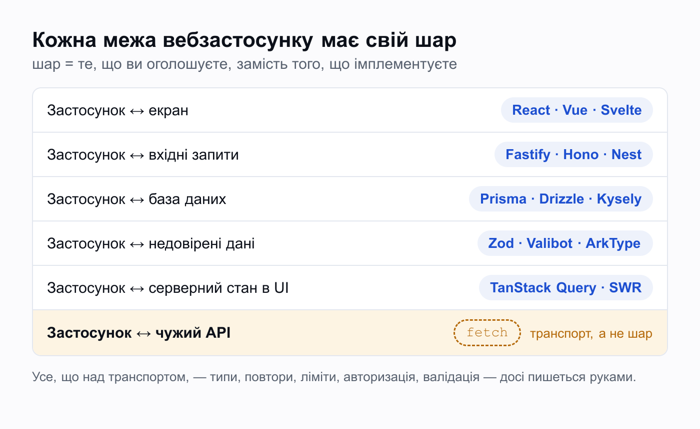

# Вебекосистемі бракує цілого шару. Я знаю, бо переписую його в кожному проєкті

У кожному проєкті, який ходить у чужі API, я рано чи пізно пишу той самий код: типізовані обгортки навколо ендпоінтів, валідацію відповідей, повтори, таймаути, оновлення токена. Не тому, що мені бракує дисципліни чи бібліотек у `package.json`, а тому, що це єдина межа вебстека, якою екосистема так і не опікувалась. У цій статті — чому ця прогалина взагалі існує, чому звичні інструменти її не закривають і як цей шар виглядає, коли його не імплементують, а оголошують.

## Шар, який я переписую щоразу

Історія на кожному проєкті однакова. Фічі потрібні дані з іншого сервісу, тож зʼявляється `listUsers` — десяток рядків навколо `fetch`, які ходять на `/users` і парсять JSON. Далі шар росте — по одному інциденту за раз. Відповіді потрібен тип, тож зʼявляється каст. У провайдера поганий тиждень, тож я пишу `withRetry` і обгортаю виклик. Запит завис у проді, тож додаю `AbortController` і таймаут. Токен протух посеред запиту, тож логіка оновлення переїжджає в окремий хелпер. Кілька місяців — і функція виглядає так:

```ts twoslash
// @noErrors
// Виросло, а не спроєктовано: кожен шматок зʼявився того тижня, коли щось зламалось.
import { getToken } from './auth/token';
import { withRetry } from './utils/retry';

export async function listUsers(): Promise<User[]> {
    const ctl = new AbortController();
    const timer = setTimeout(() => ctl.abort(), 10_000);
    try {
        const res = await withRetry(() =>
            fetch('https://api.example.com/users', {
                headers: { Authorization: `Bearer ${await getToken()}` },
                signal: ctl.signal,
            }),
        );
        if (!res.ok) throw new Error(`HTTP ${res.status}`);
        return (await res.json()) as User[]; // заявка, а не перевірка
    } finally {
        clearTimeout(timer);
    }
}
```

Нічого з цього не є помилкою. Це те, що робить обережний інженер, коли платформа дає йому транспорт, а проблема живе поверхом вище. Але відступіть на крок і подивіться, чим є цей код: інфраструктурою. Жоден його рядок — не та фіча, яку я мав робити, і кожна витрачена на нього година — з бюджету доменної логіки.

Ба гірше: у цього шару дві властивості, яких ви не пробачили б жодній залежності. Він ніколи не завершений — це сайд-проєкт усередині продукту, тож у ньому є повтор, але без backoff; таймаут на одному виклику, але не на решті одинадцяти; а тротлінг зʼявляється лише після перших 429 — і зазвичай у вигляді `sleep(200)`. І він не переноситься: наступному проєкту потрібен той самий шар, але цей вріс у форми конкретної кодобази, тож я пишу його знову. Один із найпоширеніших шматків інфраструктури в індустрії переписується руками, всюди, безперервно — і навіть не має назви.

## Кожній іншій межі — по шару

Порівняйте, як стек поводиться з рештою меж, які перетинає ваш код:



Кожен інструмент на цій схемі заробив свій рядок однаково: він перетворив те, що ви колись імплементували, на те, що ви оголошуєте. Ви не пишете оновлення DOM — ви оголошуєте компоненти, а React звіряє дерево. Ви не пишете пул зʼєднань і конструктор запитів — ви оголошуєте схему даних. Ви не пишете парсери — ви оголошуєте Zod-схему, і парсер зʼявляється сам. Цей обмін — імплементація в бібліотеці, декларація у вашому коді — саме це й означає, що шар існує.

Крім останнього рядка. `fetch` — це транспорт. Він добре носить байти, і це вся його робота: він нічого не знає про типи, повтори, ліміти, авторизацію чи те, чи відповідь досі тієї форми, на яку розраховує ваш код. Усе, що над транспортом, — усе, що в `listUsers`, — досі імплементуєте ви, в кожній кодобазі. Для найпоширенішої межі з усіх — ваш застосунок викликає API, який вам не належить, — відповідь екосистеми: труба.

## Чужий кінець дроту

Ця прогалина — не недогляд. Це єдина межа стека, де інший бік не лежить у вашому репозиторії, і саме це ламає обидва прийоми, на яких тримається решта шарів.

Ваші компоненти, роути й схема бази їдуть у прод разом із кодом, який їх використовує, тож їхні шари можуть перевірити контракт заздалегідь: перейменуйте колонку — і міграція та запит зламаються в одному коміті. API, який ви викликаєте, релізиться з чужого репозиторію, за чужим розкладом і без жодного обовʼязку вас попередити. Коли форма його відповіді змінюється, у вас не рухається ніщо: ніщо не перекомпілюється, жоден тип не червоніє, і перше середовище, яке дізнається про зміну, — прод. Контракт із чужим кодом неможливо гарантувати на етапі компіляції. Його можна лише перевіряти в рантаймі — звіряючи з байтами, які реально прийшли.

Саме тому інструменти, що підійшли до цієї ніші найближче, зупиняються, не дійшовши. HTTP-клієнти — axios, ky, got — покращують транспорт і закінчуються там, де закінчується транспорт: тіло відповіді досі нетипізоване, а клей із повторів, авторизації та валідації довкола виклику досі ваш. Кодогенерація — openapi-typescript, Orval, Kubb — цілиться в правильний шар і досягає його, коли специфікація існує, актуальна й чесна. Для великих публічних API це правда; для внутрішнього сервісу, вся документація якого — README дворічної давнини, — ні. Одна родина інструментів зупиняється під шаром; інша залежить від специфікації, якої довгий хвіст API ніколи не публікував. Між ними шар лишився вам.

## Той самий шар, але оголошений

Такому поширеному шару належиться імʼя, і правильне випливає з того, що він робить. Стібок — це те, чим зʼєднують два шматки тканини, скроєні окремо. Саме це відбувається на цій межі — ваш застосунок зшивається із софтом, зробленим у чужому репозиторії, — тож назвімо цей шар зшиванням: один стібок на кожен ендпоінт, від якого ви залежите.

Я робив цю рутину стільки разів, що зрештою виніс її в open-source бібліотеку — StitchAPI (тепер зрозуміло, звідки назва). Весь її дизайн тримається на одному правилі: на цій межі ніщо не імплементується — лише оголошується. Це in-process TypeScript із нулем залежностей, побудований навколо одного примітива — стібка: ви оголошуєте ендпоінт — де він живе, якої форми його відповідь, як авторизується і як йому дозволено падати — і отримуєте типізовану функцію.

```ts twoslash
import { drift, stitch } from 'stitchapi';
import { bearer, env } from 'stitchapi/auth';
import { z } from 'zod';

const User = z.object({ id: z.number(), name: z.string() });

const listUsers = stitch({
    baseUrl: 'https://api.example.com',
    path: '/users',
    auth: bearer(env('API_TOKEN')),
    // валідує кожну живу відповідь і повідомляє про дрифт
    output: drift(z.array(User)),
    retry: 3,
    throttle: '10/s',
    timeout: '10s',
});

const users = await listUsers();
// users: { id: number; name: string }[]
```

Ця декларація — знову `listUsers`: той самий ендпоінт, ті самі клопоти. Але кожен рядок тепер — конфігурація, а імплементація за ним їде в бібліотеці, а не росте у вашій папці `utils`. Голі значення несуть повноцінні політики: `retry: 3` — це експоненційний backoff із джитером, який поважає `Retry-After`, коли сервер його надсилає; `timeout: '10s'` обмежує весь виклик разом із повторами й паузами між ними; `throttle: '10/s'` розводить виклики цього стібка в часі. І кожен шорткат виростає в обʼєкт того дня, коли ендпоінту треба більше: `pool: 'host'` на `throttle` ділить один лімітер між усіма стібками на цей хост — те, чого жоден саморобний хелпер не вміє, бо кожен колсайт знає лише про себе.


`drift` — це та частина, яка бере межу всерйоз. Чужий кінець може змінитися мовчки, тож стібок валідує кожну живу відповідь за оголошеною схемою й повідомляє про розбіжності сигналом відповідного рівня просто на межі: недеклароване нове поле — як інформацію, зламану форму — як типізовану помилку. А не як `undefined`, що виринає на три шари глибше. Статичний тип на `users` виводиться з тієї ж схеми, що працює в рантаймі, тож тип, на який ви спираєтеся, і перевірка, що його охороняє, не можуть розійтися.

І саме декларування закриває проблему вічного сайд-проєкту: розширювати цей шар — більше не інженерна робота. Коли наступного кварталу якийсь ендпоінт почне падати серіями, фікс — ще одне поле в декларації, `circuit: [5, '30s']`, запобіжник. А не хелпер, який треба спроєктувати, написати, покрити тестами й супроводжувати. Шар перестає бути вічно недописаним, бо дописувати більше нічого.

## Чим це не є

Три знайомі інструменти живуть поруч із цією нішею, і жоден із них — не цей шар:

- **TanStack Query керує серверним станом у вашому UI; стібок — це сам виклик.** Query опікується кешем, інвалідацією та рефетчем усередині дерева компонентів, а як `queryFn` бере будь-яку функцію, що повертає проміс, — те, що відбувається всередині цієї функції, свідомо поза його зоною. Стібок і є цією функцією — типізованою, валідованою, стійкою — і так само працює поза UI: у крон-джобі, у воркері черги, в AI-агенті.
- **Воркфлоу-платформи оркеструють процеси; стібок — одна функція.** Temporal, n8n і Zapier ганяють багатокрокові флоу на власному рантаймі, який треба розгортати й супроводжувати. Стібок — in-process: скомпонувати два виклики — це звичайний TypeScript, і хостити нічого не треба.
- **Це не черговий HTTP-клієнт і не генератор коду.** Транспорт лишається той, що у вас сьогодні, — `fetch`, axios, будь-що за адаптером. І немає згенерованого коду, який треба комітити: декларація і є рантаймом, тому це працює з API, які ніколи не публікували специфікацію.

## Почніть з одного ендпоінта

Цей шар у вас уже є — питання лише у формі: писаний руками в кожному проєкті чи оголошений по ендпоінту поверх спільної імплементації. Перехід — не міграція: візьміть ендпоінт, який болить найбільше, — нестабільний, затиснутий рейт-лімітом або той, чия форма минулого кварталу попливла, — і оголосіть його поруч із кодом, який він замінює. Решта колсайтів працює як працювала; шар сходиться по одному ендпоінту за раз. Зникає не шар — він вам завжди був потрібен, — а рутина його побудови: наступне, чого ця межа від вас захоче, — поле в декларації, а не ще один хелпер у `utils`.

Спробувати можна з одного ендпоінта у власному коді — або одразу в [живому playground](https://stitchapi.dev/playground), просто в браузері, нічого не встановлюючи. Код — на [GitHub](https://github.com/rejifald/StitchAPI), пакет — [stitchapi на npm](https://www.npmjs.com/package/stitchapi).

_Disclaimer: я автор і мейнтейнер StitchAPI. Бібліотека — Apache-2.0, нуль залежностей; буду радий зворотному звʼязку, особливо критичному._
