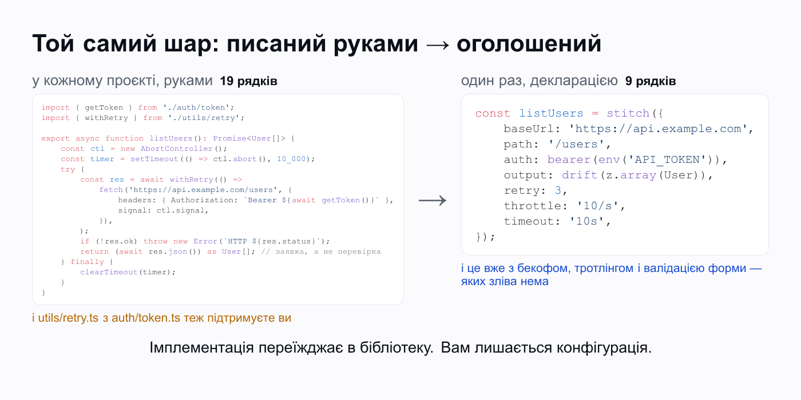

# Кожну межу вебзастосунку хтось закрив бібліотекою. Крім тієї, де ви ходите в чужий API

Кожен новий проєкт починається в мене однаково. Десь на другому тижні треба сходити в чужий API, і я ловлю себе на тому, що відкриваю старий репозиторій — подивитись, як я робив це минулого разу.

Скопіювати звідти нічого не вийде. Той `withRetry` тягне за собою локальний логер, логер тягне конфіг, конфіг тягне половину того проєкту. Плюс NDA. Тож я закриваю вкладку і пишу все заново.

Про те, у що цей код зрештою перетворюється, я вже писав тут — [«На пенсію api.ts»](https://dou.ua/forums/topic/60943/), про ентропію одного файла. А ця стаття про питання, яке лишилось у мене після неї: чому я взагалі його пишу? У 2026 році, коли бібліотека є буквально на все.

## Той самий код, тільки в іншому репозиторії

Починається завжди невинно. Для фічі потрібні юзери з іншого сервісу, я пишу `listUsers`: десяток рядків навколо `fetch`, сходити на `/users`, розпарсити JSON.

Далі функція росте. Не за планом, а по одному інциденту.

Відповідь треба якось типізувати, і туди їде каст. У провайдера поганий тиждень, зʼявляється `withRetry`. Один запит зависає в проді на дві хвилини, і додається `AbortController`. Токен протухає посеред запиту, тож логіка оновлення переїжджає в окремий хелпер, бо в тілі функції вона вже не влазить. Місяців за три воно виглядає так:

```ts twoslash
// @noErrors
// Ніхто це не проєктував. Кожен шматок приїхав того тижня, коли щось зламалось.
import { getToken } from './auth/token';
import { withRetry } from './utils/retry';

export async function listUsers(): Promise<User[]> {
    const ctl = new AbortController();
    const timer = setTimeout(() => ctl.abort(), 10_000);
    try {
        const res = await withRetry(() =>
            fetch('https://api.example.com/users', {
                headers: { Authorization: `Bearer ${await getToken()}` },
                signal: ctl.signal,
            }),
        );
        if (!res.ok) throw new Error(`HTTP ${res.status}`);
        return (await res.json()) as User[]; // не перевірка, а обіцянка
    } finally {
        clearTimeout(timer);
    }
}
```

Тут немає жодного поганого рядка. Це нормальна робота обережного інженера, якому платформа дала транспорт, а розбиратися доводиться поверхом вище.

Але подивіться, що це за код по суті. Інфраструктура. Жоден рядок тут не є тією фічею, заради якої я сюди прийшов, і кожна витрачена на нього година знята з бюджету доменної логіки.

Проблема навіть не в годинах. У цього шару є дві властивості, яких ви б не стерпіли в жодній залежності зі свого `package.json`.

Він ніколи не дописаний. Це сайд-проєкт усередині продукту, тож повтори в ньому є, але без backoff. Таймаут стоїть на одному виклику з дванадцяти. Тротлінг зʼявляється після перших 429 і зазвичай у вигляді `sleep(200)` десь усередині циклу.

І він не переїжджає. Наступному проєкту потрібен рівно той самий шар, але цей уже вріс у форми конкретної кодобази: її типи, її логер, її спосіб діставати конфіг. Тому я відкриваю порожній файл і починаю спочатку. Один із найпоширеніших шматків інфраструктури в індустрії пишеться руками, в кожній команді, роками. І назви в нього досі немає.

## А тепер подивіться на решту стека

Мені знадобилось непристойно багато часу, щоб помітити очевидне: це єдине місце в стеку, де так.

Порахуйте межі, які перетинає ваш код.

| Межа                             | Чия це робота           |
| -------------------------------- | ----------------------- |
| Застосунок ↔ екран               | React, Vue, Svelte      |
| Застосунок ↔ вхідні запити       | Fastify, Hono, Nest     |
| Застосунок ↔ база даних          | Prisma, Drizzle, Kysely |
| Застосунок ↔ недовірені дані     | Zod, Valibot, ArkType   |
| Застосунок ↔ серверний стан в UI | TanStack Query, SWR     |
| **Застосунок ↔ чужий API**       | **`fetch`**             |

Кожен рядок тут зароблено однаково. Інструмент забирає собі те, що ви колись писали руками, а вам лишає опис того, чого ви хочете.

DOM ви не оновлюєте: описуєте компонент, далі React сам звіряє дерево. Схему бази теж описуєте, а пул зʼєднань і побудову SQL за вас робить Prisma. Валідатор руками вже років пʼять ніхто не пише — є `z.object()`, і парсер випадає з нього сам собою. Ось цей обмін і означає, що шар існує: важка частина живе в бібліотеці, у вас лишається опис.

Крім останнього рядка. `fetch` — це труба. Він добре носить байти, і на цьому його робота закінчується: він нічого не знає ні про типи, ні про повтори, ні про ліміти, ні про авторизацію, ні про те, чи відповідь досі тієї форми, на яку розраховує код навколо. Усе, що вище труби, тобто весь мій `listUsers`, досі пишу я. І ви. У кожній кодобазі окремо.

Для найпоширенішої межі з усіх відповідь екосистеми — труба.

## Тому що другий кінець не ваш

Спершу я думав, що це просто недогляд. Не дійшли руки, буває.

Не недогляд. Це єдина межа стека, де другий бік не лежить у вашому репозиторії, і саме через це не працюють обидва трюки, на яких тримаються всі інші шари.

Компоненти, роути і схема бази їдуть у прод разом із кодом, який їх викликає. Тому їхні шари можуть перевірити контракт заздалегідь: перейменували колонку — міграція і запит зламались в одному коміті, ще до мержу.

API, який ви викликаєте, релізиться з чужого репозиторію, за чужим розкладом і без жодного обовʼязку вас попереджати. Коли форма його відповіді змінюється, у вас не відбувається взагалі нічого. Нічого не перекомпілюється, жоден тип не червоніє, а перше середовище, яке дізнається про зміну, — прод. Зазвичай через тікет від саппорту.

Контракт із кодом, якого ви не контролюєте, неможливо гарантувати на компіляції. Його можна тільки перевіряти в рантаймі, по байтах, які реально прийшли. Іншого способу немає.

## «Ну є ж axios» і «візьми кодогенерацію»

Це два перших заперечення, і обидва по суті.

З axios я прожив довго і нічого проти нього не маю. Але axios, `ky`, `got` покращують транспорт і закінчуються рівно там, де закінчується транспорт. Тіло відповіді як було `any`, так і лишилось, а весь клей навколо виклику — повтори, оновлення токена, валідація — досі ваш. Інтерсептори тут не рахуються: це той самий монстр, просто переїхав в інший файл.

Кодогенерація цілиться в правильний шар і в нього влучає. Коли специфікація існує, вона актуальна і не бреше — беріть кодогенерацію, серйозно, я не намагаюсь її витіснити. Питання тільки в тому, як часто ці три умови збігаються одночасно. Для великих публічних API — часто. Для внутрішнього сервісу сусідньої команди — ніколи: там уся документація це README дворічної давнини і тред у слаку.

Виходить, одна родина інструментів зупиняється під шаром, а друга залежить від артефакту, якого довгий хвіст API просто не має. Між ними шар лишився нам.

## Той самий шар, тільки описаний

Якщо річ така поширена, у неї має бути назва. Я довго крутив варіанти і зупинився на найбуквальнішому: стібок. Ним зшивають два шматки тканини, скроєні окремо, і на цій межі відбувається рівно це — ваш застосунок зшивається з софтом із чужого репозиторію. Один стібок на кожен ендпоінт, від якого ви залежите.

Звідси й назва бібліотеки, яку я зрештою написав, бо втомився переписувати цей шар руками: StitchAPI. Правило в неї одне: на цій межі нічого не пишеться, все описується. Це звичайний TypeScript у вашому ж процесі, без залежностей, без сервера і без згенерованого коду, який треба комітити.

Той самий `listUsers`, той самий набір клопотів:

```ts twoslash
import { drift, stitch } from 'stitchapi';
import { bearer, env } from 'stitchapi/auth';
import { z } from 'zod';

const User = z.object({ id: z.number(), name: z.string() });

const listUsers = stitch({
    baseUrl: 'https://api.example.com',
    path: '/users',
    auth: bearer(env('API_TOKEN')),
    // валідує кожну живу відповідь і повідомляє про дрифт
    output: drift(z.array(User)),
    retry: 3,
    throttle: '10/s',
    timeout: '10s',
});

const users = await listUsers();
// users: { id: number; name: string }[]
```



Тепер кожен рядок тут просто конфігурація, а код за нею живе в бібліотеці, а не росте в моїй папці `utils`.

Голі значення розгортаються у повноцінні політики. `retry: 3` — це експоненційний backoff із джитером, який ще й поважає `Retry-After`, коли сервер його надсилає. `timeout: '10s'` обмежує весь виклик разом із повторами й паузами між ними, а не кожну спробу окремо. `throttle: '10/s'` розводить виклики в часі проактивно, не чекаючи першої 429.

І кожен шорткат розгортається в обʼєкт того дня, коли ендпоінту стане тісно. Скажімо, `pool: 'host'` на тротлінгу ділить один лімітер між усіма стібками на цей хост. Саморобний хелпер так не вміє в принципі, бо кожен колсайт знає тільки про себе.

`drift` — це та частина, заради якої все й затівалось. Раз другий кінець може змінитись мовчки, стібок звіряє кожну живу відповідь з оголошеною схемою і повідомляє про розбіжність одразу на межі. Нове поле, якого немає у вашій схемі, проходить як інформаційний сигнал, зламана форма — як типізована помилка просто в місці виклику. А не як `undefined`, що виринає трьома шарами глибше у компоненті.

Статичний тип на `users` при цьому виводиться з тієї самої схеми, яка працює в рантаймі. Тому тип, на який ви спираєтесь, і перевірка, що його стереже, не можуть розʼїхатись.

Є ще один побічний ефект, і як на мене він головний. Розширювати цей шар більше не інженерна робота. Коли наступного кварталу якийсь ендпоінт почне падати серіями, фікс виглядає як `circuit: [5, '30s']` у декларації — запобіжник, який після пʼяти поспіль невдач на тридцять секунд перестає гатити в мертвий сервіс. Не хелпер, який треба спроєктувати, написати, покрити тестами і потім супроводжувати. Шар перестає бути вічно недописаним просто тому, що дописувати в ньому нічого.

## Де воно не підходить

Тепер чесна частина, бо без неї це просто реклама.

Якщо у вендора живий OpenAPI, який справді підтримують, і вам потрібен увесь його API — беріть кодогенерацію. Описати двісті ендпоінтів руками гірше, ніж згенерувати їх з файла. Профіль, на якому виграє декларація, інший: ендпоінтів десяток-другий, специфікації немає або вона бреше, і болить не обсяг, а надійність.

Якщо в проєкті три виклики і жоден із них не критичний, вам вистачить `fetch`. Тягнути бібліотеку заради трьох викликів зайве, і я не робитиму вигляд, що ні.

Валідація в рантаймі теж не безкоштовна. На гарячому шляху з великими масивами це видно в цифрах, і там доведеться або звужувати схему, або міряти і вирішувати предметно.

І головне. Бібліотека молода: до 1.0 вона ще не доїхала, мейнтейнер у неї поки один, екосистеми довкола немає. Якщо для вашої команди це стоп-фактор — це нормальний стоп-фактор, я його чудово розумію.

## Почніть з одного ендпоінта

Цей шар у вас уже є. Питання лише в тому, у якій він формі: написаний руками в кожному проєкті чи описаний по ендпоінту поверх спільної реалізації.

Переїзд тут не міграція. Візьміть один ендпоінт, який болить найбільше — нестабільний, затиснутий рейт-лімітом або той, чия форма минулого кварталу попливла, — і опишіть його поруч із кодом, який він замінює. Решта колсайтів працює як працювала, а шар сходиться по одному ендпоінту за раз.

Зникає не шар, він вам завжди був потрібен. Зникає рутина його побудови: наступне, чого ця межа від вас захоче, — поле в декларації, а не ще один хелпер в `utils`.

Спробувати можна просто в браузері, нічого не встановлюючи: [живий playground](https://stitchapi.dev/playground). Код — на [GitHub](https://github.com/rejifald/StitchAPI), пакет — [stitchapi](https://www.npmjs.com/package/stitchapi) на npm.

_Disclaimer: я автор і мейнтейнер StitchAPI. Бібліотека — Apache-2.0, нуль залежностей; буду радий зворотному звʼязку, особливо критичному._
