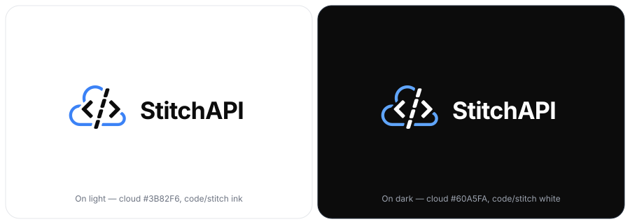
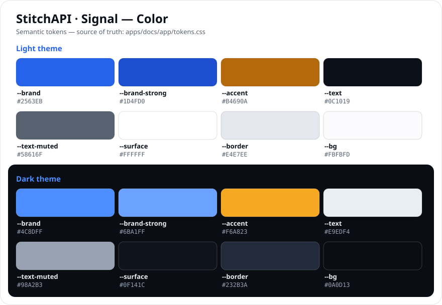

# StitchAPI — Brandbook

> [!NOTE]
>
> **Brand:** _Signal_ (electric blue + amber) · working draft, 2026-06. The
> **source of truth is the code**: semantic color + type tokens live in
> [`apps/docs/app/tokens.css`](../../apps/docs/app/tokens.css), are mirrored into
> Tailwind's `@theme` in [`global.css`](../../apps/docs/app/global.css), and the
> mark is [`logo.tsx`](../../apps/docs/components/logo.tsx). This page _mirrors_
> them — when a token or the mark changes, update it here in the same PR so it
> can't drift.

StitchAPI turns any API into a typed, resilient function — _API stitching_.
The brand carries the same idea: a precise, engineered mark — a cloud crossed by
`</>` with a dashed **"stitch" seam** — over a calm, code-forward surface. The
_Signal_ direction pairs an electric **brand blue** with a complementary
**amber** accent (the seam), used sparingly.

---

## Contents

1. [Logo](#1-logo)
2. [Color](#2-color)
3. [Typography](#3-typography)
4. [The ripple motif](#4-the-ripple-motif)
5. [Voice](#5-voice)
6. [Asset inventory](#6-asset-inventory)
7. [Maintenance & open items](#7-maintenance--open-items)

---

## 1. Logo

The mark is a **cloud** (brand blue) crossed by a **`</>` code bracket** with a
**dashed "stitch" seam** (amber) — the network, the API, and the stitch that
joins them.

-   The **cloud** always carries the **brand blue**.
-   The **`</>` brackets** are **ink** (foreground): near-black on light surfaces,
    off-white on dark — so the mark reads on either.
-   The **dashed seam** is the **amber accent** — the one warm note in the system.

### Favicon / app-icon exception **[decided]**

At favicon and app-icon scale the amber dash is too small to read, so the
**seam reverts to ink** there (blue cloud + ink glyph on a light tile). This is
why [`icon.png`](../../apps/docs/app/icon.png),
[`apple-icon.png`](../../apps/docs/app/apple-icon.png), and the tile
[`logomark.svg`](../../apps/docs/public/logomark.svg) carry an ink seam, while
the lockup and banners carry the amber one.

### Variants **[decided]**

| Variant      | When to use                              | Source                                                                                                       |
| ------------ | ---------------------------------------- | ------------------------------------------------------------------------------------------------------------ |
| **Lockup**   | Default — navbar, README, social, docs   | `<Logo />` in [logo.tsx](../../apps/docs/components/logo.tsx); [`logo.svg`](../../apps/docs/public/logo.svg) |
| **Logomark** | Tight spaces — favicon, avatar, app icon | `<Logomark />`; tile [`logomark.svg`](../../apps/docs/public/logomark.svg)                                   |
| **Banner**   | Repo / social hero (theme-paired)        | [`baner_light.png`](../media/baner_light.png) · [`baner_dark.png`](../media/baner_dark.png)                  |

The mark geometry comes straight from the artwork: viewBox `726 542 148 116`
(cloud + brackets + stitch).

### Clearspace & minimum size **[proposed]**

-   **Clearspace** — keep free space on all four sides equal to the height of the
    `</>` chevron (≈ ¼ of the mark height). Nothing intrudes into that margin.
-   **Minimum size** — logomark no smaller than **20 px** tall on screen (it ships
    at 24 px in the navbar). Full lockup no smaller than **96 px** wide before the
    wordmark loses legibility.

### Do / Don't

**Do**

-   Use the live `<Logo />` / `<Logomark />` component, or the provided SVGs —
    never a screenshot.
-   Keep the cloud in **brand blue**, the brackets in **ink**, and the seam in
    **amber** (ink at favicon scale).
-   Give it room — respect the clearspace.

**Don't**

-   Recolor the cloud to anything but the brand blue, or add gradients / shadows /
    outlines.
-   Stretch, rotate, skew, or rearrange the cloud / brackets / stitch.
-   Put the ink-on-light mark on a dark background — switch to the dark variant.
-   Re-letter or re-space the wordmark, or write it as **"Stitch API"** (two words)
    or **"stitchapi"** — it is always one word, **StitchAPI**, capital `S` and
    `API`.
-   Crop the dashed stitch seam out of the mark, or recolor it away from amber on
    the lockup.

---

## 2. Color

_Signal_ is a **semantic** token system — reference colors only via `var(--*)`,
never a raw hex in product code. Every token is theme-scoped: `:root` is light,
`.dark` is dark, and `color-mix()` derivations re-resolve per theme.

### Brand & accent **[decided]**

| Token            | Light     | Dark      | Role                                             |
| ---------------- | --------- | --------- | ------------------------------------------------ |
| `--brand`        | `#2563EB` | `#4C8DFF` | Primary fill / line / link · the logo cloud      |
| `--brand-strong` | `#1D4FD0` | `#6BA1FF` | Hover / emphasis                                 |
| `--brand-ink`    | `#FFFFFF` | `#06101F` | Text / glyph **on** a brand fill                 |
| `--accent`       | `#B4690A` | `#F6A823` | Complementary amber — the stitch seam, _sparing_ |
| `--accent-ink`   | `#FFFFFF` | `#1A1305` | Text / glyph **on** an accent fill               |

### Surfaces & text

| Token          | Light     | Dark      | Role                              |
| -------------- | --------- | --------- | --------------------------------- |
| `--bg`         | `#FBFBFD` | `#0A0D13` | App background                    |
| `--surface`    | `#FFFFFF` | `#0F141C` | Cards, panels                     |
| `--surface-2`  | `#F6F7F9` | `#151B26` | Raised / inset sections           |
| `--border`     | `#E4E7EE` | `#232B3A` | Component borders                 |
| `--text`       | `#0C1019` | `#E9EDF4` | Primary copy · the ink mark glyph |
| `--text-muted` | `#58616F` | `#98A2B3` | Secondary copy                    |
| `--text-faint` | `#8B94A2` | `#616B7C` | Captions, meta, code comments     |

### Code / syntax tokens

The code panels derive their palette from the brand tokens (`--syn-*` in
`tokens.css`): keyword = `--brand`, function / type = `--accent`, string =
`accent` mixed 80% into `text`, comment = `--text-faint` (italic), punctuation =
`--text-muted`.

### Accessibility **[decided / note]**

Signal was tuned for WCAG AA on **both** themes (computed from the token values
over each theme's `--bg`):

| Pairing                       | Light     | Dark   | Verdict                                   |
| ----------------------------- | --------- | ------ | ----------------------------------------- |
| `--brand` text/link on `--bg` | **5.0:1** | 6.1:1  | ✓ AA text (the old `#3B82F6` was 3.4 ✗)   |
| `--brand-strong` on `--bg`    | 6.6:1     | 7.6:1  | ✓ emphasis / hover                        |
| `--text` on `--bg`            | 18.4:1    | 16.6:1 | ✓ AAA                                     |
| `--text-muted` on `--bg`      | 6.1:1     | 7.6:1  | ✓ AA                                      |
| `--brand-ink` on `--brand`    | 5.2:1     | 6.0:1  | ✓ button labels                           |
| `--accent` on `--bg`          | 4.1:1     | 9.8:1  | light = AA-**large** only — use sparingly |
| `--accent-ink` on `--accent`  | 4.2:1     | 9.3:1  | light = AA-**large** only                 |

> [!IMPORTANT]
>
> On **light**, amber clears ~4.1:1 — fine for the seam, icons, ≥24 px text and
> short labels (the 3:1 / AA-large tiers), but **not** body-size text or long
> runs. It's a deliberate accent, not a text color. On dark it passes
> everywhere.

---

## 3. Typography

Three Grotesk-family faces, wired through `next/font/google` in
[`layout.tsx`](../../apps/docs/app/layout.tsx) and exposed as `--font-*` in
`tokens.css`:

| Role          | Typeface              | Token            | Notes                                        |
| ------------- | --------------------- | ---------------- | -------------------------------------------- |
| **Display**   | **Schibsted Grotesk** | `--font-display` | Hero, headings, the **wordmark**             |
| **Body / UI** | **Hanken Grotesk**    | `--font-sans`    | Body copy, navigation, the brand voice       |
| **Mono**      | **IBM Plex Mono**     | `--font-mono`    | Code, the `stitch(...)` primitive, API names |

The type scale (`--fs-*`), weights (`--fw-*`) and tracking (`--ls-*`) are tokens
too; display and `h2` are fluid (`clamp`).

### Wordmark **[decided]**

"**StitchAPI**" — set in the display face, tracking `--ls-snug` (`-0.02em`), one
word, capital `S` and `API`. Never "Stitch API", "StitchApi", or "stitchapi".
Implemented in `<Logo />`.

---

## 4. The ripple motif

The signature texture is a field of faint **concentric dashed "ripple" rings** —
radar-like, _imperfect_ fingerprint/topographic contours generated
deterministically (no randomness, so server and client agree). Behind hero and
CTA sections each contour breathes on a staggered 7 s loop (`ripple-breathe`);
motion is disabled under `prefers-reduced-motion`. Implemented as
[`BrandBackdrop`](<../../apps/docs/app/(home)/components/brand-backdrop.tsx>) +
`.brand-backdrop` in [`global.css`](../../apps/docs/app/global.css). The same
motif fills the banner backdrops.

Use it sparingly and low-contrast — it's a backdrop, never foreground. Pair it
with the brand-blue radial glow, not as a standalone graphic.

> [!NOTE]
>
> The masked ripple backdrop renders fine in real browsers but makes **headless
> preview screenshots** capture blank for scrolled content — verify lower
> sections via the DOM or by temporarily hiding `.brand-backdrop`.

---

## 5. Voice

Precise, calm, engineer-to-engineer. Lowercase `stitch` for the primitive,
`StitchAPI` for the product. Favor concrete verbs ("a typed stitch **replaces**
`fetch`") over adjectives. Confident about the idea, honest about maturity (the
docs carry a "release candidate" banner — keep that candor: feature-complete and
in real use, but pin exact versions until stable 1.0).

---

## 6. Asset inventory

**Web-ready (in the repo, served by the docs site)**

| Asset               | Path                                                                                                             |
| ------------------- | ---------------------------------------------------------------------------------------------------------------- |
| Logo lockup (SVG)   | [`apps/docs/public/logo.svg`](../../apps/docs/public/logo.svg)                                                   |
| Logomark tile (SVG) | [`apps/docs/public/logomark.svg`](../../apps/docs/public/logomark.svg)                                           |
| Live components     | [`apps/docs/components/logo.tsx`](../../apps/docs/components/logo.tsx)                                           |
| Favicon / icons     | [`apps/docs/app/icon.png`](../../apps/docs/app/icon.png), [`apple-icon.png`](../../apps/docs/app/apple-icon.png) |
| Banners             | [`docs/media/baner_light.png`](../media/baner_light.png), [`baner_dark.png`](../media/baner_dark.png)            |
| Color & type tokens | [`apps/docs/app/tokens.css`](../../apps/docs/app/tokens.css)                                                     |
| Brandbook previews  | [`docs/brand/assets/`](./assets)                                                                                 |

The PNGs are regenerated from the SVG sources + the Signal tokens; the
generator's recipe is documented in [`assets/README.md`](./assets/README.md).

**Master files (vector + print)** — `.ai`, `.eps`, layered `.pdf`, full-res
`.png` — belong in [`docs/brand/source/`](./source). They currently live only in
iCloud and are **not yet versioned** — see that folder's README.

---

## 7. Maintenance & open items

**Resolved by the Signal adoption** (was open under the old "Tailwind blue"
brand):

-   **Light-mode link contrast** — `--brand #2563EB` is **5.0:1** on `--bg`
    (passes AA text); the old `#3B82F6` was 3.4:1 ✗.
-   **The orphaned amber** is now a first-class `--accent` token (the stitch seam),
    not just a syntax color.
-   **Three disagreeing blues** collapse into one `--brand` referenced everywhere
    via tokens.

**Open / notes:**

-   **[note]** Amber on **light** is AA-large only (≈4.1:1) — keep it to the seam,
    icons, and short ≥24 px labels; never body text. See [§2](#2-color).
-   **[note]** The static `public/*.svg` bake the **light** Signal colors (they are
    not theme-aware). For dark surfaces use the dark banner, or the live
    `<Logo />` / `<Logomark />` components (which track the theme via CSS vars).
-   **[open]** Drop the duplicate
    [`docs/media/logo_baner_light.png`](../media/logo_baner_light.png)
    (byte-identical to `baner_light.png`) once
    [`packages/core/README.md`](../../packages/core/README.md) — which references
    it via a **pinned-commit** raw URL — is repointed at `baner_light.png` on a
    commit that exists post-merge.
-   **[open]** Import the master files (`.svg .png .pdf .ai .eps`) from iCloud into
    [`docs/brand/source/`](./source) so the brand isn't stranded outside the repo;
    then re-export the web SVGs from the updated masters rather than hand-recoloring.
-   **[open]** Define and document semantic state colors (success / warning / error
    / info) as Signal tokens rather than inheriting Fumadocs' defaults.
