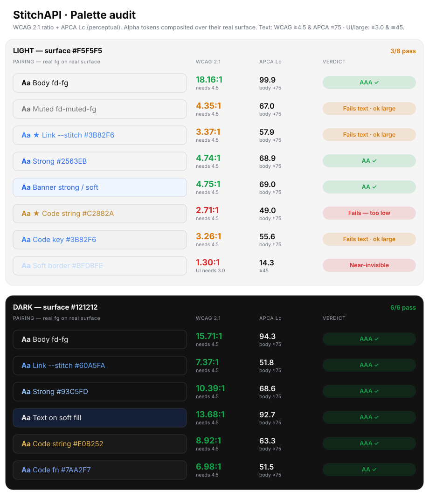

# StitchAPI — Brandbook

> [!NOTE]
>
> **Status:** working draft · 2026-06. The **source of truth** is the code: color tokens live in
> [`apps/docs/app/global.css`](../../apps/docs/app/global.css) and the logo in
> [`apps/docs/components/logo.tsx`](../../apps/docs/components/logo.tsx). This document mirrors them — when a
> token or the mark changes, update this page in the same PR so it can't drift. Items are tagged
> **[decided]**, **[proposed]**, or **[open]**.

StitchAPI is an agent-native runtime where a typed **stitch** replaces `fetch`. The brand carries the same
idea: a precise, engineered mark (cloud + `</>` + a dashed "stitch" seam) over a calm, code-forward surface.

---

## Contents

1. [Logo](#1-logo)
2. [Color](#2-color)
3. [Typography](#3-typography)
4. [The ripple motif](#4-the-ripple-motif)
5. [Voice](#5-voice)
6. [Asset inventory](#6-asset-inventory)
7. [Maintenance & open items](#7-maintenance--open-items)

---

## 1. Logo

The mark is a **cloud** (brand blue) crossed by a **`</>` code bracket** with a **dashed "stitch" seam** — the
network, the API, and the stitch that joins them. The cloud always carries the brand blue; the code and stitch
use **ink on light** surfaces and **white on dark** surfaces, so the mark reads on either.

### Variants **[decided]**

| Variant      | When to use                              | Source                                                                                                       |
| ------------ | ---------------------------------------- | ------------------------------------------------------------------------------------------------------------ |
| **Lockup**   | Default — navbar, README, social, docs   | `<Logo />` in [logo.tsx](../../apps/docs/components/logo.tsx); [`logo.svg`](../../apps/docs/public/logo.svg) |
| **Logomark** | Tight spaces — favicon, avatar, app icon | `<Logomark />`; [`logomark.svg`](../../apps/docs/public/logomark.svg)                                        |
| **Banner**   | Repo / social hero (theme-paired)        | [`baner_light.png`](../media/baner_light.png) · [`baner_dark.png`](../media/baner_dark.png)                  |

The mark geometry comes straight from the artwork: viewBox `726 542 148 116` (cloud + brackets + stitch).

### Clearspace & minimum size **[proposed]**

-   **Clearspace** — keep free space on all four sides equal to the height of the `</>` chevron (≈ ¼ of the mark
    height). Nothing — text, rules, other logos — intrudes into that margin.
-   **Minimum size** — logomark no smaller than **20 px** tall on screen (it ships at 24 px in the navbar). Full
    lockup no smaller than **96 px** wide before the wordmark loses legibility.

### Do / Don't

**Do**

-   Use the live `<Logo />` / `<Logomark />` component, or the provided SVGs — never a screenshot.
-   Keep the cloud in brand blue and the code/stitch in ink (light) or white (dark).
-   Give it room — respect the clearspace.

**Don't**

-   Recolor the cloud to anything but the brand blue, or add gradients/shadows/outlines.
-   Stretch, rotate, skew, or rearrange the cloud / brackets / stitch.
-   Put the ink mark on a dark background or the white mark on a light one — switch variants instead.
-   Re-letter or re-space the wordmark, or write it as **"Stitch API"** (two words) or **"stitchapi"** — it is
    always one word, **StitchAPI**, capital `S` and `API`.
-   Crop the dashed stitch seam out of the mark.

---

## 2. Color

One **brand blue**, taken straight from the logo, carried by four theme-aware tokens. Everything else — page
background, text, borders, muted surfaces — inherits the **Fumadocs neutral** theme (`--color-fd-*`); the brand
blue is the single accent laid over it.

### Brand tokens **[decided]**

Defined in [`global.css`](../../apps/docs/app/global.css), exposed to Tailwind as `text-stitch`,
`bg-stitch-soft`, `border-stitch-border`, etc.

| Token             | Light     | Dark            | Role                                        |
| ----------------- | --------- | --------------- | ------------------------------------------- |
| `--stitch`        | `#3B82F6` | `#60A5FA`       | Primary accent — links, the live logo cloud |
| `--stitch-strong` | `#2563EB` | `#93C5FD`       | Hover / emphasis / icon fills               |
| `--stitch-soft`   | `#EFF6FF` | `#1E3A8A` @ 32% | Tinted fills — banners, callouts, chips     |
| `--stitch-border` | `#BFDBFE` | `#60A5FA` @ 26% | Hairlines on tinted surfaces                |

### Foundation

| Name      | Hex       | Role                                                    |
| --------- | --------- | ------------------------------------------------------- |
| Ink       | `#0C0C0C` | The code/stitch on light; near-black text & dark canvas |
| Off-white | `#E6E6E6` | Light marks/text on dark surfaces                       |
| White     | `#FFFFFF` | Light canvas; the code/stitch reversed on dark          |

> The **shipped** page surfaces are the Fumadocs neutrals, not pure white/black: `#F5F5F5` / `#121212` (page),
> `#F1F1F1` / `#191919` (card), foreground `#0A0A0A` / `#EBEBEB`. Treat those as the real canvas when checking
> contrast — the audit below does.

### Code / syntax tokens

The static code panels carry their own minimal syntax palette ([`global.css`](../../apps/docs/app/global.css)):
keyword = brand blue · string `#C2882A` / dark `#E0B252` · function `#2563EB` / dark `#7AA2F7` · comment &
punctuation = muted foreground.

> [!IMPORTANT]
>
> **Canonical blue is `#3B82F6`.** The exported master SVGs currently carry a stray `#3C82F6` (one unit off);
> normalize them to `#3B82F6` so art and token match. See [§7](#7-maintenance--open-items).

### Accessibility audit **[open]**

Every brand token is an **unmodified Tailwind blue** — `#3B82F6`/`#2563EB`/`#EFF6FF`/`#BFDBFE` are blue
500/600/50/200; the dark set is blue 400/300/900. The dark variants are tuned and pass cleanly; the **light
variants are under-tuned**. Measured WCAG 2.1 + APCA, with alpha tokens composited over their real surface
(audit is regenerated from the token values, not hand-entered):

| Light-mode pairing                | WCAG       | Verdict                                                    |
| --------------------------------- | ---------- | ---------------------------------------------------------- |
| Link `--stitch #3B82F6` on page   | **3.37:1** | ✗ fails AA text (needs 4.5) — even on pure white only 3.68 |
| `--stitch-strong #2563EB` on page | 4.74:1     | ✓ the AA-safe text blue — use this for links/text on light |
| Code string `#C2882A` on card     | **2.71:1** | ✗ worst pairing in the set                                 |
| Code keyword `#3B82F6` on card    | 3.26:1     | ✗ fails AA text                                            |
| Soft border `#BFDBFE` on page     | 1.30:1     | near-invisible as a separator                              |

Dark mode passes everywhere (links 7.4:1, strong 10.4:1, code 7–9:1). The fixes — and the deeper coherence
problem (three different "blues" in the live product) — are in [§7](#7-maintenance--open-items).

---

## 3. Typography

| Role          | Typeface                                                                                        | Notes                                                                                                                                                                                  |
| ------------- | ----------------------------------------------------------------------------------------------- | -------------------------------------------------------------------------------------------------------------------------------------------------------------------------------------- |
| **Sans / UI** | **Inter** — `next/font/google`, set on `<html>` in [layout.tsx](../../apps/docs/app/layout.tsx) | Body, headings, navigation. The primary brand voice.                                                                                                                                   |
| **Monospace** | System stack via `--fd-font-mono` (`ui-monospace, SFMono-Regular, Menlo, monospace`)            | Code, the `stitch(...)` primitive, inline API names. **[open]** — pin an explicit brand mono (Geist Mono / JetBrains Mono); the product is code-forward and deserves a deliberate one. |

### Wordmark **[decided]**

"**StitchAPI**" — **Inter Bold**, tracking `-0.02em` (`tracking-tight`), one word, capital `S` and `API`.
Never "Stitch API", "StitchApi", or "stitchapi". Implemented in `<Logo />`.

---

## 4. The ripple motif

The signature texture is a field of faint **concentric dashed "ripple" rings** — radar-like — behind hero and
CTA sections. Each contour breathes on a staggered 7 s loop (`ripple-breathe`), so the pulse ripples outward;
motion is disabled under `prefers-reduced-motion`. Implemented as `.brand-backdrop` in
[`global.css`](../../apps/docs/app/global.css) (hero variant anchors top-left, CTA variant centers).

Use it sparingly and low-contrast — it's a backdrop, never foreground. Pair it with the brand-blue radial glow,
not as a standalone graphic.

> [!NOTE]
>
> The masked ripple backdrop renders fine in real browsers but makes **headless preview screenshots** capture
> blank for scrolled content — verify lower sections via the DOM or by temporarily hiding `.brand-backdrop`.

---

## 5. Voice

Precise, calm, engineer-to-engineer. Lowercase `stitch` for the primitive, `StitchAPI` for the product. Favor
concrete verbs ("a typed stitch **replaces** `fetch`") over adjectives. Confident about the idea, honest about
maturity (the docs carry an "under heavy development" banner — keep that candor).

---

## 6. Asset inventory

**Web-ready (in the repo, served by the docs site)**

| Asset              | Path                                                                                                             |
| ------------------ | ---------------------------------------------------------------------------------------------------------------- |
| Logo lockup (SVG)  | [`apps/docs/public/logo.svg`](../../apps/docs/public/logo.svg)                                                   |
| Logomark (SVG)     | [`apps/docs/public/logomark.svg`](../../apps/docs/public/logomark.svg)                                           |
| Live components    | [`apps/docs/components/logo.tsx`](../../apps/docs/components/logo.tsx)                                           |
| Favicon / icons    | [`apps/docs/app/icon.png`](../../apps/docs/app/icon.png), [`apple-icon.png`](../../apps/docs/app/apple-icon.png) |
| Banners            | [`docs/media/baner_light.png`](../media/baner_light.png), [`baner_dark.png`](../media/baner_dark.png)            |
| Color tokens       | [`apps/docs/app/global.css`](../../apps/docs/app/global.css)                                                     |
| Brandbook previews | [`docs/brand/assets/`](./assets)                                                                                 |

**Master files (vector + print)** — `.ai`, `.eps`, layered `.pdf`, full-res `.png` — belong in
[`docs/brand/source/`](./source). They currently live only in iCloud and are **not yet versioned** — see that
folder's README for the import path.

---

## 7. Maintenance & open items

**Color — light-mode accessibility (dark mode already passes):**

-   **[open]** Blue text/links on light fail WCAG AA: `--stitch #3B82F6` on the page is **3.37:1** (needs 4.5), and
    only 3.68 even on pure white. Use `--stitch-strong #2563EB` (4.74:1) for any blue **text or link** on light;
    reserve `#3B82F6` for ≥24 px text, icons, and fills (the 3:1 tier). Apply the same swap to the light **code
    keyword**.
-   **[open]** Darken the **code-string** amber `#C2882A` (**2.71:1** — the worst pairing) until it clears 4.5 on
    the `#F1F1F1` card, or move strings to a more legible hue.
-   **[open]** `--stitch-border #BFDBFE` is **1.30:1** on the page — invisible as a separator. Fine if purely
    decorative; bump it if it is meant to delineate.

**Color — coherence & distinctiveness:**

-   **[open]** Every brand token is **unmodified Tailwind blue** (500/600/50/200 · 400/300/900) — the most generic
    accent on the web, shared with Tailwind's own docs. Either shift hue/chroma to own a recognizable blue (tuned
    for AA on light), or keep it deliberately and lean on the logo + ripple motif for distinctiveness.
-   **[open]** Three "blues" disagree in the live product: brand `--stitch` is sRGB `#3B82F6` (Tailwind v3),
    Fumadocs `--color-fd-info` is `oklch(62.3% 0.214 259.8)` (Tailwind v4 blue — _almost_ but not identical), and
    `--color-fd-primary` is **neutral near-black** — so primary buttons, active nav, and focus rings in the docs
    are not the brand color, and brand classes appear only on the landing page. Wire `--color-fd-primary` (and the
    prose link color) to the AA-safe brand blue and align `--color-fd-info` to it, so there is **one** blue.
-   **[open]** The amber is an **orphan** — it lives only in syntax highlighting, is never declared a brand color,
    and runs warm against the cool blue. Promote and tune it into a real secondary, or drop it.
-   **[open]** Semantic states (success / warning / error / idea) are silently inherited from the Fumadocs OKLCH
    set — not chosen, documented, or harmonized with the brand. Decide and record them.

**Assets & type:**

-   **[open]** Import the master files (logo / logomark / banners as `.svg .png .pdf .ai .eps`) from iCloud into
    [`docs/brand/source/`](./source) so the brand isn't stranded outside the repo.
-   **[open]** Normalize the stray `#3C82F6` in the exported master SVGs to the canonical **`#3B82F6`**.
-   **[open]** Drop the duplicate [`docs/media/logo_baner_light.png`](../media/logo_baner_light.png) (byte-identical
    to `baner_light.png`); first repoint [`packages/core/README.md`](../../packages/core/README.md), which still
    references it via a pinned-commit URL, at `baner_light.png`.
-   **[open]** Pin an explicit brand monospace (see [§3](#3-typography)).
