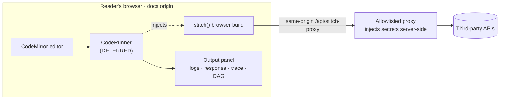

# StitchAPI Docs Playground

Live, in-browser playground widgets for the StitchAPI docs — a reader edits a
`stitch()` snippet and runs it against a real API, inline.

> **This folder is a scaffold + spec, not a running app.** The hard part — the
> in-browser **code-execution engine — is intentionally deferred.** What's here
> defines its _shape and requirements_ and stubs it behind a swappable `CodeRunner`
> interface, so the UI shell and the docs can proceed without it.

## Status — 2026-06-11

| Piece                                      | Status                                                                                                     |
| ------------------------------------------ | ---------------------------------------------------------------------------------------------------------- |
| Docs framework                             | **Fumadocs** (React/Next, OSS, self-hosted) — decided                                                      |
| Execution engine                           | **In-house**, implementation **DEFERRED** → [RATIONALE.md](./RATIONALE.md)                                 |
| Engine contract ("the shape")              | **Defined** → [REQUIREMENTS.md](./REQUIREMENTS.md) + [`component/runner.ts`](./component/runner.ts)        |
| Playground UI shell                        | **Scaffolded** against the contract → [`component/StitchPlayground.tsx`](./component/StitchPlayground.tsx) |
| Options evaluated                          | **Recorded** → [COMPETITORS.md](./COMPETITORS.md)                                                          |
| Fumadocs app scaffold                      | not started                                                                                                |
| Same-origin proxy + browser `stitch` build | not started (largest unknown)                                                                              |

## Contents

-   **[RATIONALE.md](./RATIONALE.md)** — decision record: why in-house over react-live / Sandpack / LiveCodes / Runno.
-   **[REQUIREMENTS.md](./REQUIREMENTS.md)** — the engine's shape & requirements (FR/NFR, Node-only boundary, security, acceptance criteria).
-   **[COMPETITORS.md](./COMPETITORS.md)** — verified options scorecard + evidence.
-   **[component/runner.ts](./component/runner.ts)** — the `CodeRunner` contract + `DeferredRunner` + `mockRunner`.
-   **[component/StitchPlayground.tsx](./component/StitchPlayground.tsx)** — the UI shell (editor + output), built against the contract.

## How the pieces fit

The UI talks only to `CodeRunner`. Today that's the deferred stub / mock; tomorrow
it's the in-house engine — **no UI change required.** Authenticated demos route
through a same-origin proxy so the editor source never shows a credential.

## Why deferred?

The engine is the genuinely hard, genuinely uncertain part (in-page eval security,
async output rendering, and a browser `stitch` build that shims Node-only APIs —
REQUIREMENTS.md §6). Defining the contract first lets the docs site, UI, and content
move in parallel and de-risks the engine into a focused spike.

## Next steps

1. Scaffold the Fumadocs (Next.js) app and drop `<StitchPlayground/>` into an MDX page (renders today via `mockRunner`).
2. Stand up the same-origin allowlisted proxy (Next Route Handler / Cloudflare Worker) with server-side secret injection.
3. Spike the in-house engine: Sucrase + in-page async eval + console capture → `InHouseRunner implements CodeRunner`.
4. Produce the browser `stitch` build with Node-API shims (REQUIREMENTS.md §6).
5. Wire `result.trace` → Mermaid build-stitch DAG in the output panel.

## Caveat

Maintenance/health facts in COMPETITORS.md are a **2026-06-11 snapshot**. Re-verify
npm dist-tags and last-commit dates before building.
