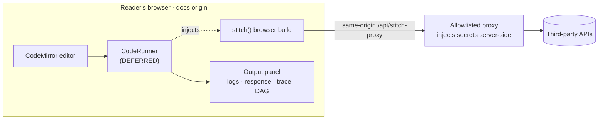

# StitchAPI Docs Playground

Live, in-browser playground widgets for the StitchAPI docs — a reader edits a
`stitch()` snippet and runs it against a real API, inline.

> **This folder is a decision record + spec, not a running app.** The hard part —
> the in-browser **code-execution engine — is intentionally deferred.** What's here
> defines its _shape and requirements_ behind a swappable `CodeRunner` contract, so
> the docs and the eventual UI can be built against a stable interface.

## Status — 2026-06-11

| Piece                                      | Status                                                                               |
| ------------------------------------------ | ------------------------------------------------------------------------------------ |
| Docs framework                             | **Fumadocs** (React/Next, OSS, self-hosted) — decided                                |
| Execution engine                           | **In-house**, implementation **DEFERRED** → [RATIONALE.md](./RATIONALE.md)           |
| Engine contract ("the shape")              | **Specified** → [REQUIREMENTS.md](./REQUIREMENTS.md) §1 (the `CodeRunner` interface) |
| Playground UI shell                        | not started — to be built in the Fumadocs app against the `CodeRunner` contract      |
| Options evaluated                          | **Recorded** → [COMPETITORS.md](./COMPETITORS.md)                                    |
| Fumadocs app scaffold                      | **Scaffolded** → `apps/docs`                                                         |
| Same-origin proxy + browser `stitch` build | not started (largest unknown)                                                        |

## Contents

-   **[RATIONALE.md](./RATIONALE.md)** — decision record: why in-house over react-live / Sandpack / LiveCodes / Runno.
-   **[REQUIREMENTS.md](./REQUIREMENTS.md)** — the engine's shape & requirements (FR/NFR, the `CodeRunner` contract in §1, Node-only boundary, security, acceptance criteria).
-   **[COMPETITORS.md](./COMPETITORS.md)** — verified options scorecard + evidence.

## How the pieces fit

The UI will talk only to `CodeRunner`, so the in-house engine can be dropped in
later with **no UI change required.** Authenticated demos route through a
same-origin proxy so the editor source never shows a credential.

## Why deferred?

The engine is the genuinely hard, genuinely uncertain part (in-page eval security,
async output rendering, and a browser `stitch` build that shims Node-only APIs —
REQUIREMENTS.md §6). Defining the contract first lets the docs site, UI, and content
move in parallel and de-risks the engine into a focused spike.

## Next steps

1. Build the playground UI shell in the Fumadocs app against the `CodeRunner` contract (REQUIREMENTS.md §1) and drop it into an MDX page (mock runner until the engine lands).
2. Stand up the same-origin allowlisted proxy (Next Route Handler / Cloudflare Worker) with server-side secret injection.
3. Spike the in-house engine: Sucrase + in-page async eval + console capture → `InHouseRunner implements CodeRunner`.
4. Produce the browser `stitch` build with Node-API shims (REQUIREMENTS.md §6).
5. Wire `result.trace` → Mermaid build-stitch DAG in the output panel.

## Caveat

Maintenance/health facts in COMPETITORS.md are a **2026-06-11 snapshot**. Re-verify
npm dist-tags and last-commit dates before building.
