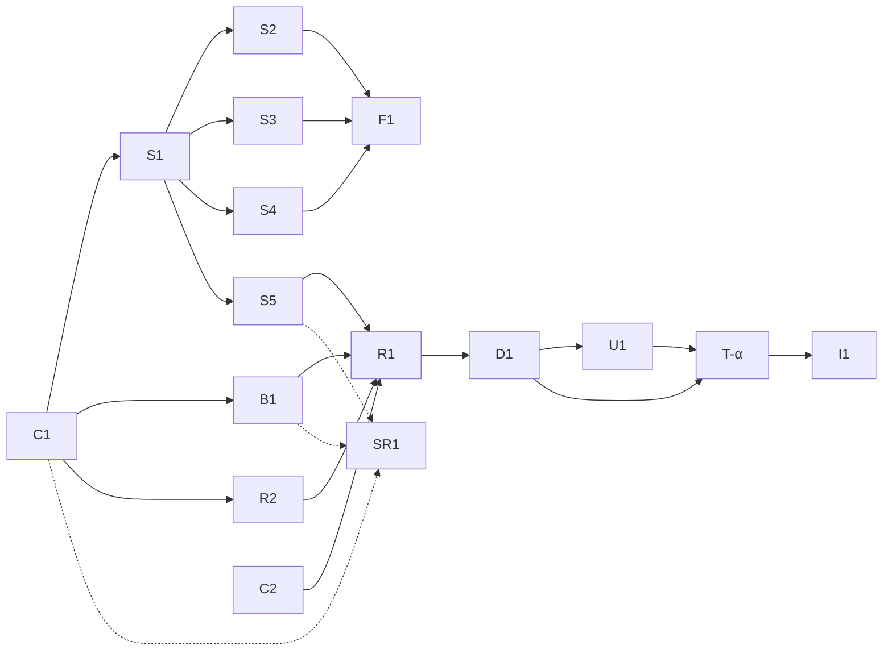

# Playground Sandbox — Implementation Plan (subagent dispatch)

> **Status:** Ready to dispatch · **Date:** 2026-06-11
> **Design of record:** [SANDBOX.md](./SANDBOX.md) · **Contract:** [`component/runner.ts`](./component/runner.ts)

This plan decomposes the sandbox build into **independently dispatchable tasks**,
each sized and scoped for a specific **model tier**. The goal is that a cheaper model
can execute a task in isolation by coding against a **frozen contract**, with an
Opus-tier pass reserved for the load-bearing design, security, and integration work.

---

## 1. How to dispatch

- **One task = one subagent.** Each task card below is self-contained: it names the
  files to touch, the contract to code against, and binary acceptance checks.
- **Freeze the contracts first (Wave 0).** Every downstream task imports types from
  §3. They must not be edited by lower tiers — changing a shared contract is an
  Opus-tier task that re-ratifies the dependents.
- **Dispatch by wave.** Tasks in the same wave have no inter-dependencies and run in
  parallel. A wave starts only when its predecessor wave's acceptance checks pass.
- **Worktree isolation** for any wave with >1 task touching files concurrently.

### Tier legend

| Tier | Model | Use for | Guardrail |
|---|---|---|---|
| **T3** | Opus | Contracts, security boundary, dispatcher heuristic, final integration & sign-off | Owns anything where a wrong call is expensive or cross-cutting |
| **T2** | Sonnet | Well-specced implementation against a frozen contract (runners, simulator handlers, transpile) | May not alter §3 contracts; flags ambiguity back to T3 |
| **T1** | Haiku | Mechanical scaffolding, fixtures, boilerplate, doc/index wiring, test stubs | Pure pattern-fill; no design decisions |

---

## 2. Task map at a glance

| ID | Task | Tier | Depends on | Wave |
|---|---|---|---|---|
| **C1** | Freeze shared contracts (runner + sim + dispatch types) | T3 | — | 0 |
| **C2** | Security & isolation spec sign-off (caps, CSP, no-egress invariants) | T3 | — | 0 |
| **S1** | Simulator package scaffold (`@stitchapi/sandbox-sim`) | T1 | C1 | 1 |
| **B1** | Browser `stitch` build with Node-surface shims | T3 | C1 | 1 |
| **S2** | Simulator handlers — errors/status + latency | T2 | S1 | 2 |
| **S3** | Simulator handlers — streaming/SSE + LLM endpoint | T2 | S1 | 2 |
| **S4** | Simulator handlers — auth/capability + rate-limit/retry/drift | T2 | S1 | 2 |
| **S5** | Sim adapters: browser fetch-shim + node fetch-shim (isomorphic) | T2 | S1 | 2 |
| **R1** | Browser Web Worker runner (`browserWorkerRunner`) | T2 | C1, C2, B1, S5 | 3 |
| **R2** | Transpile module (Sucrase + Babel fallback, lazy) | T2 | C1 | 2 |
| **D1** | Dispatcher + static surface scan (`dispatchRunner`) | T3 | C1, R1 | 4 |
| **U1** | Wire `<StitchPlayground/>` to `dispatchRunner`; output panel streaming/DAG | T2 | C1, R1 | 4 |
| **F1** | Fixtures + sandbox index (`/__sandbox`) + seed data | T1 | S2–S4 | 3 |
| **T-α** | Test suite: runner caps, no-egress, determinism, acceptance §9 | T2 | R1, D1, U1 | 5 |
| **SR1** | Server run-service (isolated-vm pool) — **Phase 3, deferred** | T3 | C1, C2, B1, S5 | (later) |
| **I1** | Integration + acceptance sign-off (SANDBOX §9) | T3 | all of Wave 5 | 6 |

---

## 3. Shared contracts (Wave 0 — frozen before anything else)

Lower tiers import these; they do not invent them.

- **`CodeRunner`, `RunRequest`, `RunResult`, `RunError`, `StitchTraceEntry`, `LogEntry`**
  — already defined in [`component/runner.ts`](./component/runner.ts). **C1** relocates
  them into the docs app and adds only the additive `StitchTraceEntry.stream?` hint
  from [SANDBOX.md](./SANDBOX.md) §8.
- **Simulator handler contract** (new, authored by **C1**):

  ```ts
  // one handler definition, run by both adapters (browser fetch-shim + node)
  export interface SimRequest { method: string; url: URL; headers: Headers; body?: unknown }
  export interface SimResponse { status: number; headers?: Record<string,string>;
                                 body?: unknown; stream?: AsyncIterable<Uint8Array> }
  export interface SimHandler { match(req: SimRequest): boolean;
                                handle(req: SimRequest, knobs: SimKnobs): SimResponse | Promise<SimResponse> }
  // knobs parsed from reserved query params: __status __latencyMs __stream __drift __flaky …
  export interface SimKnobs { status?: number; latencyMs?: number;
                              stream?: 'chunked'|'sse'; drift?: boolean; flaky?: number }
  ```

- **Dispatch contract** (new, authored by **C1**):

  ```ts
  export type Tier = 'browser' | 'server';
  export interface SurfaceScan { tier: Tier; nodeOnlyHits: string[]; ambiguous: boolean }
  export function scanSurface(code: string): SurfaceScan;       // implemented in D1
  export function dispatchRunner(opts: DispatchOpts): CodeRunner; // implemented in D1
  ```

> **Rule:** a T1/T2 task that finds a contract insufficient **stops and reports**; it
> does not widen the contract. Contract changes are re-ratified by **C1 (T3)**.

---

## 4. Task cards

### Wave 0 — contracts & security (T3)

**C1 — Freeze shared contracts.** Relocate `runner.ts` types into the docs app;
author the simulator handler + dispatch contracts (§3); add the additive
`StitchTraceEntry.stream?`. *Deliverable:* a `contracts/` module that every other task
imports. *Accept:* `tsc` passes; no behavioural code; existing `StitchPlayground`
still type-checks against it.

**C2 — Security & isolation spec sign-off.** Pin the hard invariants the runners must
satisfy: Worker-terminate timeout, `signal` wiring, CSP `connect-src`/`worker-src`,
"the only `fetch` is the sim shim," isolate caps for SR1. *Deliverable:* a checklist
in this folder that T-α turns into tests. *Accept:* every SANDBOX §7 + §9 line maps to
a checkable assertion.

### Wave 1 — keystone scaffolds

**S1 — Simulator package scaffold (T1).** Create `packages/sandbox-sim` (pnpm
workspace member): `package.json`, `tsconfig`, `src/index.ts` exporting an empty
handler registry typed against the C1 contract, build wiring. *Accept:* `pnpm -r build`
includes it; exports the registry type; zero handlers yet.

**B1 — Browser `stitch` build with Node-surface shims (T3).** The largest unknown
(SANDBOX §10.4, REQUIREMENTS §6). Produce a browser-targeted `stitch` entry from
`packages/core` where `keychain`/`env` return documented demo values, `cookieSession`
is an in-memory jar, JSONL trace is a no-op surfaced via `StitchTraceEntry`, and
`fetch` is taken from injected scope. *Accept:* a Tier-1 snippet runs unmodified in a
Worker; shimmed surfaces emit the documented notice; bundle has no Node built-ins.

### Wave 2 — parallel implementation against frozen contracts

**S2 — Errors/status + latency handlers (T2).** Implement `SimHandler`s for the
"Errors & status" and "Latency" groups (SANDBOX §4.2), driven by `__status`/`__latencyMs`.
*Accept:* deterministic; unit tests per behaviour.

**S3 — Streaming/SSE + LLM endpoint (T2).** Chunked + SSE token streaming and a
chat/completions-shaped endpoint with tool-call JSON. *Accept:* emits an
`AsyncIterable` stream; SSE framing valid; deterministic token sequence from a seed.

**S4 — Auth/capability + rate-limit/retry/drift (T2).** 401-without-token,
`429`+`Retry-After`, flaky-then-success (`__flaky`), schema-drift (`__drift`).
*Accept:* drift response fails a sample Zod schema; flaky succeeds on the Nth try
deterministically.

**S5 — Isomorphic adapters (T2).** A browser `fetch`-shim and a node `fetch`-shim that
both dispatch the same handler registry; unknown route → sandbox-404 (SANDBOX §4.3).
*Accept:* identical handler → identical response in jsdom and node; unknown host 404s
without a real socket.

**R2 — Transpile module (T2).** Sucrase TS+JSX erasure with `@babel/standalone`
fallback, lazy-loaded; maps transpile failures to `RunError{phase:'transpile',line,column}`.
*Accept:* TS annotations erased; a syntax error yields a transpile-phase `RunError`, no throw.

### Wave 3 — browser runner & fixtures

**R1 — Browser Web Worker runner (T2).** Implement `browserWorkerRunner: CodeRunner`
per SANDBOX §5: spawn a Worker, inject scope (B1 `stitch` + captured console + S5
browser shim), async IIFE + top-level await, console capture in order, `timeoutMs` via
`worker.terminate()`, `signal` wiring, transpile via R2. *Accept:* SANDBOX §9 browser
checks pass for this runner in isolation (incl. `while(true){}` killed; Stop aborts).

**F1 — Fixtures, seed data, `/__sandbox` index (T1).** Seeded demo dataset + the
self-describing endpoint listing available demo routes. *Accept:* `GET /__sandbox`
returns the route catalogue; same seed → same data.

### Wave 4 — dispatch & UI

**D1 — Dispatcher + static surface scan (T3).** Implement `scanSurface` (the §3 / §3-of-SANDBOX
classification, conservative: ambiguous → browser+shim+notice) and `dispatchRunner`
composing browser (+ later server) runners. *Accept:* each core export routes to the
documented tier; dynamic access flagged `ambiguous` and routed safe.

**U1 — Wire UI + streaming/DAG output (T2).** Replace `mockRunner` default with
`dispatchRunner`; render streamed responses incrementally and `trace` → response card +
Mermaid build-stitch DAG. *Accept:* a streaming snippet renders progressively; a
composed pipeline renders a DAG.

### Wave 5 — verification

**T-α — Test suite (T2).** Encode SANDBOX §9 acceptance + C2 invariants: caps,
no-egress (assert no real network attempted), determinism, shim notices, no state bleed.
*Accept:* all SANDBOX §9 boxes are green in CI.

### Wave 6 — sign-off (T3)

**I1 — Integration & acceptance.** Run the full matrix end-to-end in the docs app,
confirm the §9 criteria, file follow-ups for Phase 3 (SR1). *Accept:* SANDBOX §9 met;
SR1 scoped.

### Phase 3 (deferred) — server tier

**SR1 — Server run-service (T3).** `isolated-vm` pool inside a `worker_threads` pool,
caps, per-IP rate limit, node sim shim, real Node `stitch`. Build only once browser
coverage is shipped and Node-surface demand is confirmed (SANDBOX §6). `serverRunner`
slots into `dispatchRunner` with no UI change.

---

## 5. Dependency DAG



---

## 6. Parallel waves (dispatch schedule)

| Wave | Tasks (parallel) | Tiers | Gate to advance |
|---|---|---|---|
| **0** | C1, C2 | T3, T3 | contracts compile; invariants checklisted |
| **1** | S1, B1 | T1, T3 | sim builds empty; a snippet runs in a Worker via B1 |
| **2** | S2, S3, S4, S5, R2 | T2×5 | each handler group + adapters + transpile unit-tested |
| **3** | R1, F1 | T2, T1 | `browserWorkerRunner` passes §9 browser checks solo |
| **4** | D1, U1 | T3, T2 | dispatch routes correctly; UI renders stream + DAG |
| **5** | T-α | T2 | full §9 suite green |
| **6** | I1 | T3 | acceptance sign-off; SR1 filed |

**Critical path:** C1 → B1 → R1 → D1 → U1 → T-α → I1. S2–S4/F1 parallelize off it.

---

## 7. Tier-assignment rationale

- **T3 (Opus)** holds the four load-bearing pieces only: the **contracts** (C1) that
  everything imports, the **security boundary** (C2) where a wrong call is a real
  vulnerability, the **browser `stitch` shim build** (B1, the largest unknown), the
  **dispatcher heuristic** (D1) where mis-routing untrusted code matters, and
  **integration** (I1, SR1).
- **T2 (Sonnet)** does the bulk: every simulator handler group, the adapters, the
  transpile module, the Worker runner, the UI wiring, and the tests — all against
  contracts frozen by C1, so the design judgment is already made.
- **T1 (Haiku)** does pure scaffolding: the package skeleton (S1) and the
  fixtures/index (F1) — pattern-fill with no decisions.

> If a T2/T1 task hits a genuine design fork, it **returns to T3** rather than guessing —
> the frozen-contract rule is what makes lower-tier dispatch safe here.
