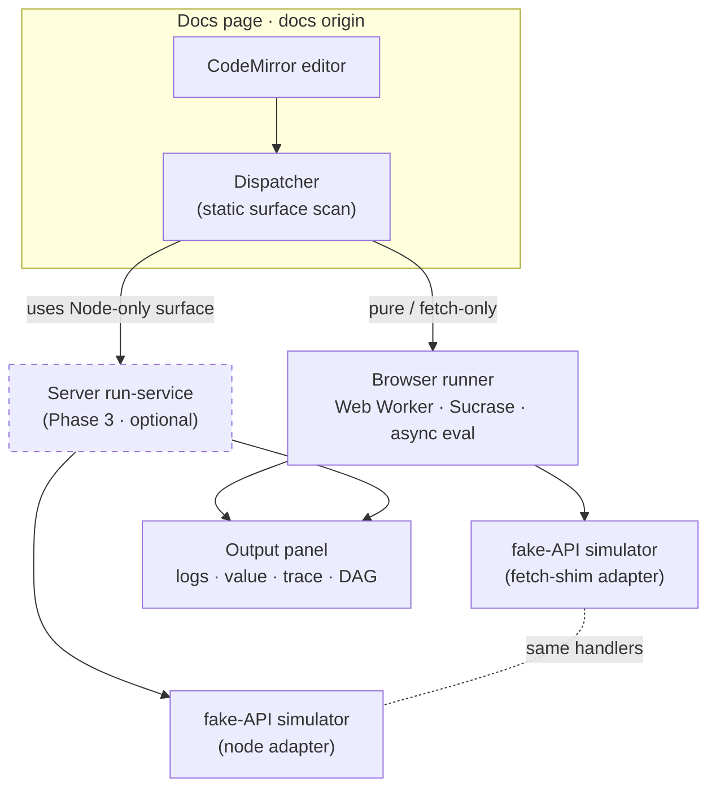

# Playground Sandbox — Execution & Isolation Design

> **Status:** Accepted design (implementation **NOT STARTED**)
> **Date:** 2026-06-11 · **Decider:** @rejifald
> **Supersedes parts of:** [REQUIREMENTS.md](./REQUIREMENTS.md) §2 FR2, §6–§8 · [RATIONALE.md](./RATIONALE.md) "same-origin proxy"
> **Related:** [COMPETITORS.md](./COMPETITORS.md) · contract in [`component/runner.ts`](./component/runner.ts) · UI in [`component/StitchPlayground.tsx`](./component/StitchPlayground.tsx)
> **Build sequencing:** [SANDBOX-IMPLEMENTATION-PLAN.md](./SANDBOX-IMPLEMENTATION-PLAN.md)

This document defines **how a docs `stitch()` snippet actually runs**: where it
executes, how it is isolated, and what it talks to instead of the real internet.
It revises the earlier playground spec, which assumed in-page eval against a live
allowlisted proxy. The product is now: **a freely-editable REPL that runs against a
purpose-built fake-API simulator — no real network, ever.**

---

## 1. What changed, and why

The earlier spec ([REQUIREMENTS.md](./REQUIREMENTS.md)) committed to **in-page,
same-origin** eval whose trust boundary was a **server-side allowlist proxy** that
injected real secrets to reach **real authenticated APIs**. This design reverses
three of those decisions:

| # | Earlier spec | This design | Why |
|---|---|---|---|
| **R1** | Execution runs **in-page** on the docs main thread (FR2, "non-negotiable"). | Execution is **hybrid**: a **Web Worker** in the browser for most snippets, a **server isolate** only for Node-only surfaces. | A snippet with `while(true){}` on the main thread **cannot be killed**; only a Worker/isolate can be terminated to honor the timeout & resource-abuse requirement (FR7). |
| **R2** | A same-origin **allowlist proxy injects real secrets** to call real APIs (Tier 2). | **No proxy, no secrets, no real egress.** All network is answered by an in-process **fake-API simulator**. | The product is now deterministic demos that *simulate* behaviour (errors, streaming, auth, rate-limits, LLM responses), not live calls. With no real secret/egress, the proxy's reason to exist is gone. |
| **R3** | Trust boundary = the proxy allowlist; blast radius = "the visitor's own session." | Trust boundary = **the runtime has no network at all** + a fetch shim only the simulator answers. Server-side runs add an **isolate** boundary. | Mocked-everything shrinks the client threat surface to near zero; the only place untrusted code meets *our* infra is the optional server tier, which is isolated. |

Everything else in [REQUIREMENTS.md](./REQUIREMENTS.md) (FR1, FR3–FR6, FR8, the
`CodeRunner` contract, the output panel / Mermaid DAG payoff) **still holds**.

---

## 2. Architecture

- **The UI talks only to `CodeRunner`** (unchanged from [`runner.ts`](./component/runner.ts)).
  The **dispatcher** is itself a `CodeRunner` that delegates to a browser runner or
  a server runner based on a static scan of the snippet (§3).
- **Both runners hit the same fake-API simulator** via different adapters (§4). A
  snippet behaves identically regardless of where it runs.
- **The server tier is optional and deferred.** Phase 1–2 ship browser-only and
  cover the large majority of examples at **zero infrastructure**.

---

## 3. The split rule — by Node-only surface

All visitor code is untrusted, so "trivial vs untrusted" is not a usable split. The
split is **by capability**: a snippet runs in the browser unless it uses a stitch
surface that **does not exist in the browser** and must run on real Node.

Classification of the **develop** core exports ([`packages/core/src/index.ts`](../../packages/core/src/index.ts)):

| Browser-safe → **Browser runner** | Node-only → **Server runner** |
|---|---|
| `stitch`, `defineStitch`, `preset` | `keychain` — OS keychain access |
| `drift`, `graphql` | `env` — reads `process.env` |
| `bearer`, `apiKey`, `basic`, `oauth2` (token held in memory) | `cookieSession` — persistent cookie jar |
| `fetchAdapter` (global `fetch`, shimmed to the simulator) | `createTrace` / `multiplex` — JSONL trace files (fs) |
| `toValidator`, `memoryStore`, resilience (retry/throttle — pure) | `otlpTrace` / `otlpHttpExporter` — real network egress |
| | `cli`, `serve`, `mcp` — process / stdio / server surfaces |

**Detection** is a static scan of the (pre-transpile) source for references to the
Node-only identifiers, plus their import specifiers. It is **intentionally
conservative**:

- A clear Node-only reference → **server runner** (if the server tier is built;
  otherwise the browser runner runs it with the surface **shimmed** and shows a
  "running shimmed — `keychain` is simulated" notice).
- **Ambiguous / dynamic** access (e.g. `core['key' + 'chain']`) → **safe default**:
  browser runner + shim + notice. Never silently route dynamic code to the isolate.

> The scan is a heuristic for *routing*, not a security control. Security comes from
> the runtime having no network and no ambient authority (§7) — not from the scan.

---

## 4. The fake-API simulator (the keystone)

A single package, `@stitchapi/sandbox-sim`, defines a **fake API that is connected to
nothing** and exists only to *simulate behaviour* deterministically.

### 4.1 Isomorphic — one definition, two adapters

Handlers are written **once** and run in both environments:

- **Browser adapter:** a `fetch` shim injected into the Worker scope (Web Workers
  have no Service Worker / MSW page interception, so we inject `fetch`, not a SW).
- **Node adapter:** the same handlers wired into the server isolate's `fetch` shim.

This guarantees the two runners are behaviour-equivalent — no per-tier drift.

### 4.2 Behaviours (v1 scope)

The simulator must produce, **on demand**, every behaviour the playground exists to
show off. Requested behaviour is selected by route and/or reserved query knobs
(e.g. `?__status=500&__latencyMs=800&__stream=sse`):

| Group | Simulates | Demonstrates (stitch feature) |
|---|---|---|
| **Errors & status** | 4xx/5xx, malformed/HTML-instead-of-JSON bodies, connection-failure | error handling, validation failure |
| **Latency & streaming** | fixed/jittered delay, chunked + **SSE** token streaming | async output, timeout, cancellation (FR7) |
| **Auth / capability** | endpoints that 401 without a bearer/cookie; "capability" tokens | `bearer`/`oauth2`/`cookieSession`, "capability not credential" — all simulated |
| **Rate-limit / retry / drift** | `429` + `Retry-After`, flaky-then-success, **schema-drift** responses | `resilience` retry/throttle, on-the-fly Zod validation catching drift |
| **LLM** | a chat/completions-shaped endpoint with **SSE token streaming** + tool-call-shaped JSON | stitching an LLM API; streaming + validation end-to-end |

### 4.3 Rules

- **Deterministic.** Seeded PRNG; no wall-clock/`Math.random` in handler output paths
  — same request → same response, so docs examples are reproducible and snapshot-able.
  Determinism covers the response **bytes/structure**, *not* delivery **timing**:
  `__latencyMs` and stream pacing may vary by wall-clock; only payloads are pinned.
  (Ratified Wave 0 — resolves the §4.2 latency vs §4.3 determinism tension.)
- **Unknown host/route → documented sandbox-404.** A freely-editable REPL *will* call
  URLs the sim doesn't know. Those return a clean, explanatory body
  (`"<host> is not reachable inside the StitchAPI sandbox; available demo hosts: …"`),
  **never** a real network attempt.
- **Discoverable.** The sim ships a tiny self-describing index (`GET /__sandbox`) so
  the docs can list available demo endpoints next to the editor.

---

## 5. Browser runner (Phase 2 — covers most examples, zero infra)

Implements `CodeRunner`; runs inside a **dedicated Web Worker**:

1. **Transpile** (FR1): Sucrase TS+JSX erasure (Babel-standalone fallback), lazy-loaded.
2. **Execute** (FR3): wrap in async IIFE, inject `scope` (browser `stitch` build +
   captured `console` + the simulator's `fetch` shim), `await` the final promise.
3. **Capture** (FR4): intercept `console.*` in order into `RunResult.logs`; never
   leak to the host console.
4. **Isolate:** the Worker has its own global scope — no docs DOM/state access (the
   isolation the old spec wanted from an iframe, with a kill switch the main thread
   can't offer).
5. **Caps (FR7):** `timeoutMs` hard cap enforced by `worker.terminate()`; `signal`
   wired to both the Worker and the in-flight sim fetch. A hung snippet is killed.
6. **Errors (FR6):** transpile vs runtime separated into `RunError.phase`, with
   line/column when available; failures populate `result.error`, never reject `run()`.
7. **Node-only shims:** when routed here with a shimmed surface, `keychain`/`env`
   return documented demo values, `cookieSession` is an in-memory jar, JSONL trace is
   a no-op surfaced via `StitchTraceEntry`.

**Egress backstop:** the Worker is loaded under a CSP with `connect-src` restricted so
that even a bug can't reach the real network; the only `fetch` the snippet sees is the
simulator shim.

---

## 6. Server run-service (Phase 3 — optional, deferred)

Runs **only** Node-only-surface snippets, against the **real Node `stitch` build** so
`cookieSession`/`keychain`/`env`/JSONL trace actually execute (against the simulator).

### 6.1 Will it handle concurrency, and is it affordable?

Yes, and it's cheaper than it sounds **because it runs a minority of examples**:

- **Isolation:** [`isolated-vm`](https://github.com/laverdet/isolated-vm) — each run
  gets a fresh V8 `Isolate` (own heap, ~few MB) with **no fs, no `require`, no network**
  (only the injected sim `fetch`), and **wall-clock + CPU + memory caps**.
- **Concurrency:** V8 runs JS on the calling thread, so the isolate **pool lives inside
  a `worker_threads` pool sized to vCPUs**. Each request checks out an isolate, runs
  capped, and recycles it. Runs are short (cap ≈ 2–5 s), so a small box serves dozens
  of concurrent short runs; the service is **stateless and scales horizontally**.
- **Backpressure:** a global concurrency queue + **per-IP rate limit**; a flood
  degrades to "please wait," not a crash.
- **Cost:** one small always-warm container (≈ **$5–15/mo** for a docs demo). It is a
  Phase-3 add-on, **not** a v1 dependency.

### 6.2 Cheaper fallback

Because everything is mocked (no real secret/egress), the blast radius is small. If
`isolated-vm`'s native-addon + hosted-Node constraints prove costly, fall back to a
**hardened `worker_threads` pool** (frozen globals, no `require`, injected sim `fetch`,
time/mem caps). Weaker isolation than `isolated-vm`, acceptable for a no-network,
no-secret sandbox. The `CodeRunner` contract makes this swap a single implementation.

---

## 7. Security model (revised)

- **No ambient authority.** Neither runtime exposes the real network, filesystem, real
  env, or real secrets. The snippet's `fetch` is the simulator; that is the whole
  outside world it can see.
- **Browser blast radius = the visitor's own Worker.** No same-origin proxy, no
  credential anywhere in the system → no SSRF / open-relay / secret-leak surface that
  the old proxy design had to defend.
- **Server blast radius = one capped, network-less isolate**, recycled per run, behind
  a rate limiter. The only untrusted-code-meets-our-infra point, and it is isolated.
- **CSP** still matters for the eval in the browser; validate the `connect-src` +
  `worker-src` policy in the Phase-2 spike.

---

## 8. Contract impact

The [`CodeRunner`](./component/runner.ts) contract is **unchanged**; this design adds
implementations and one composite:

- `browserWorkerRunner: CodeRunner` (Phase 2)
- `serverRunner: CodeRunner` (Phase 3, talks to the run-service over HTTP)
- `dispatchRunner(opts): CodeRunner` — wraps the two, does the §3 static scan, and is
  what `<StitchPlayground runner={…}/>` actually receives.

Additive (non-breaking) extensions **frozen in Wave 0** (see [`contracts/`](./contracts/),
[SANDBOX-SECURITY-CHECKLIST.md](./SANDBOX-SECURITY-CHECKLIST.md)):

- `StitchTraceEntry.stream?: { chunks: number }` — render streaming/LLM responses distinctly.
- `RunError.reason?: 'throw' | 'timeout' | 'abort' | 'internal'` — so the UI and tests can
  tell a timeout from an abort from a thrown error (`phase` alone can't). Engine failures
  resolve as `reason: 'internal'`; `run()` rejects only for unrecoverable harness bugs.
- `RunResult.notices?: RunNotice[]` — the structured channel for the shimmed-surface notice
  the browser runner shows when a Node-only surface runs shimmed (§3, §5.7).
- `RunRequest.scope` already carries the browser `stitch` build + sim `fetch`; the
  dispatcher decides the scope per tier.

**Browser memory & CSP (ratified Wave 0):** the browser Worker is **time-bounded only** —
no portable per-Worker memory cap exists, and the blast radius is the visitor's own tab,
so a memory bomb is acceptable (server isolate keeps a real memory cap). CSP intent is
`connect-src 'self'` + `worker-src 'self' blob:`; the Worker's own eval needs `'unsafe-eval'`
*inside the Worker context only*. Exact tokens are validated in the Phase-2 spike.

---

## 9. Acceptance criteria (sandbox v1 = Phases 1–2)

- [ ] `const u = await stitch('https://demo.stitchapi.dev/users/2'); console.log(u)`
      renders the log, the resolved value, a `StitchTraceEntry`, and `done · <ms>`.
- [ ] A snippet hitting `?__status=500` renders a clean error, does **not** reject `run()`.
- [ ] A `?__stream=sse` / LLM endpoint renders streamed output incrementally.
- [ ] A `?__drift=1` response makes on-the-fly Zod validation fail visibly.
- [ ] `while(true){}` is **killed** at `timeoutMs` (proves the Worker, not main-thread, eval).
- [ ] **Stop** aborts an in-flight streamed response via `signal`.
- [ ] A snippet calling an unknown host renders the sandbox-404, with **no** real request.
- [ ] A snippet using `keychain` runs in the browser **shimmed**, with a visible notice
      (and, once Phase 3 exists, routes to the isolate and runs for real).
- [ ] No `globalThis` state bleed between two consecutive runs.

---

## 10. Open questions / risks

1. **Static surface detection is foolable** (dynamic property access). Mitigation: safe
   default to browser+shim+notice; never route ambiguous code to the isolate. *Risk: low.*
2. **Web Worker scope is structured-clone only** (no DOM, no functions across the
   boundary). The injected-scope contract (browser `stitch` build + sim `fetch`) must
   be Worker-constructable. *Validate first in Phase 2.*
3. **Streaming through the `fetch` shim** — the browser `stitch` build must consume
   `ReadableStream`/SSE; verify before committing to the LLM/streaming demos. *Risk: med.*
4. **Browser `stitch` build with Node shims** (REQUIREMENTS §6) — **de-risked, GO**
   (see [B1-SPIKE.md](./B1-SPIKE.md)). Entanglement is shallow: only `node:fs`/`node:path`/
   `node:crypto`, no native deps, no top-level side effects; a docs-side `stitch-browser.ts`
   + bundler alias/`define` (no fork of `packages/core`, ~0.5–1 day) bundles clean.
   **Correction to REQUIREMENTS §6's assumption:** the call hot-path is *not* Node-free —
   `engine.ts` uses `node:crypto` `randomUUID` and `stitch()`'s `getTrace()` reads
   `process.env`, so even a Tier-1 snippet pulls Node in. Both are trivial shims, but **R1
   must provide `process`/`process.env` and a `crypto` (Web Crypto) alias in the Worker
   scope**, and the browser OTLP exporter must be a no-op (don't rely on CSP alone).
5. **`isolated-vm` deploy** (native addon, hosted Node) is incompatible with static/edge
   export — hence Phase 3 is isolated as a separate service and deferred.

---

## 11. Build sequencing

Decomposed into subagent-dispatchable tasks (with model-tier assignments, the shared
contracts each task codes against, the dependency DAG, and parallel waves) in
**[SANDBOX-IMPLEMENTATION-PLAN.md](./SANDBOX-IMPLEMENTATION-PLAN.md)**.
